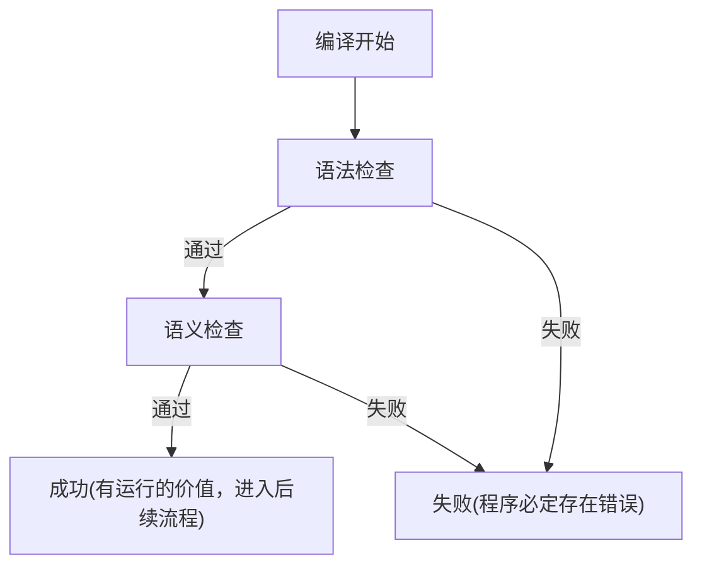
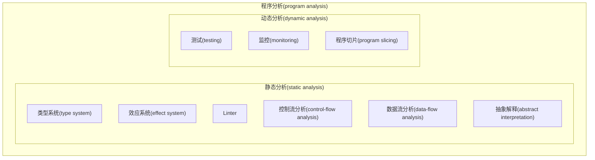
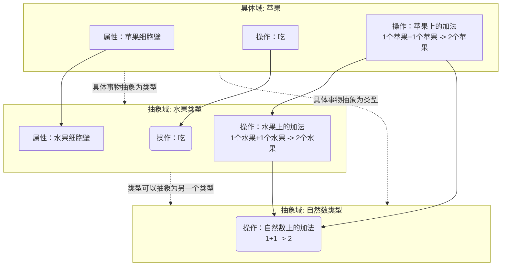

# 自然语言和编程语言中的类型

## 自然语言中的类型

在知道类型系统的定义之前，我们其实都已经是汉语这门自然语言中的「类型」专家了。

:::info 例子

例 1：自然数 997 是一个质数。

\*例 2：自然数 997 是一个运动。

:::

如果我们来判断这句话例 2 是否正确，我们可以立刻下结论——它是错的——而不用去理解这个命题涉及的任何数学概念。

——你可能会想：*自然数怎么可能会是运动呢？它们似乎是两类不相交的概念。*

我们在无意识中就运用了自然语言中的类型来排除掉了一些不正确的语句，因为这些语句在**语义**上就是错的，即便它完全符合语法。

而这可以看成是一种广义上的类型检查。我们只需要去检查这个语句中的词汇类型是否相近、是否符合常识，就可以快速地筛出那些不可能为真的语句。我们其实早就已经能够熟练地对自然语言中的语句做「类型检查」了。

那么，编程语言又如何呢？

## 编程语言中的类型

对于编程语言，我们也会有类似的**类型检查**机制。

### 编译视角看类型检查

一般来说，我们会先进行**语法检查**，再进行**语义检查**（类型检查是其中一部分），快速筛选掉那些必定存在错误的程序，而不需要去跑程序本身，最终达到提高程序的运行时安全性的目的。



### 程序分析视角看类型检查

**程序分析(program analysis)**是对程序运行时行为提供安全的、可计算的近似预测的技术[^1]。从程序分析的视角来看，编译过程中的**语法检查**和**语义检查**都是不执行程序而对目标程序进行分析的手段。这一类手段被称为**静态分析(static analysis)**。

[^1]:  Nielson, F., Nielson, H. R., & Hankin, C. (2015). Principles of program analysis. Springer.

类型检查是一种重要的静态程序分析技术，它也会被称为类型系统。



### 静态类型 vs 动态类型

*在一些编程语言中，变量的类型可以在运行程序之前就能确定下来*。

具有这种性质的语言，叫做**静态类型(statically typed)**语言；反之，则叫做**动态类型(dynamically typed)**语言。

例如，C++是静态类型语言。

```cpp {2}
bool a = true;
a = "test"; // 会在编译时报错
```

例如，JavaScript是静态类型语言。

```js {2}
let a = true;
a = 'b'; // 完全合法
```

### 强类型 vs 弱类型

表达式类型之间的转化需要显式地进行的编程语言，叫做**强类型(strongly typed)语言**。

```cpp {2}
string foo = "foo";
foo + to_string(1); // 需要显式将int转换为string类型
```

反之，那些类型之间的转化大都可以隐式进行的，叫做**弱类型(weakly typed)语言**。


```ts {2}
const foo = "foo";
foo + 1; // 无需显式转换即可相加
```

:::caution

强弱类型是一个比较主观的概念，并没有严格的学术上的定义，无需纠结于此。

:::

强对弱，静态对动态，我们有两个正交的维度。而每个编程语言各自的强弱动静也有程度差异。因此，我们可以尝试把语言根据其各个维度的程度，画在一个二维平面坐标系上，方便对不同编程语言之间进行比较。

:::tip 练习
思考你所熟悉的编程语言的强、弱、动、静性质及其程度，在平面坐标系上标出这些语言的位置。
:::

## 类型检查的抽象解释视角

### 从具体到抽象

1. **「类型」是对具体对象的抽象**。抽象让我们只关注我们所关注的「性质」，而非具体的细节。
<!-- 「类型」是对具体对象的「俯瞰」，如同眯起眼睛看世界，我们不再关注物体的每个视觉细节，而是只关注它们的颜色。 -->

2. **「类型」是一种推理工具。**在对具体对象进行抽象得到「类型」之后，我们就可以对它们的性质进行推理。例如，一旦我们知道「苹果」可以被抽象为自然数之后，其实就可以将苹果当成自然数来处理。



3. **「类型检查」是对抽象的正确性的检查。** 如果代码中进行了不正确的抽象，类型检查就会提示我们存在错误。例如，若我们尝试把「具体域：松鼠」的实例——一只松鼠——抽象为「水果类型」，那么就无法通过细胞壁这个属性的检查，因为松鼠是没有细胞壁的；若我们尝试把「自然数类型」抽象为「水果类型」，也会出现失败，因为自然数类型没有定义「操作：吃」。

### 抽象解释

抽象解释（abstract interpretation）是一种非常强大的理论框架，它可以把许多静态分析技术统一起来囊括其中。
它的核心思想是：将具体域中的程序抽象化，放到抽象域中进行推理。由此，我们从原始的程序得到了一种新的、抽象的程序。通过执行这些抽象的程序，我们可以得到原始程序的部分性质。