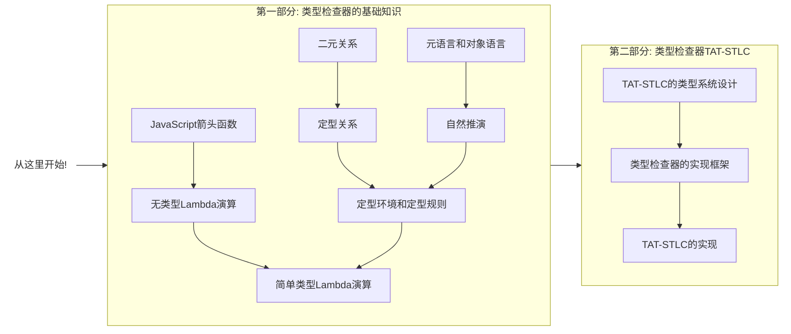

# 本节路线图

```mermaid {scale: 0.9}
flowchart LR
  subgraph Part1[第一部分: 类型检查器的基础知识]
    direction TB
    ArrowFunction[JavaScript箭头函数] --> UTLC[无类型Lambda演算]
    UTLC --> STLC
    BinaryRelation[二元关系] --> TypingRelation[定型关系]
    TypingRelation --> TypingContext[定型环境和定型规则]
    TypingContext --> STLC[简单类型Lambda演算]
    MetaLanguage[元语言和对象语言] --> NaturalDeduction[自然推演]
    NaturalDeduction --> TypingContext
  end

  subgraph Part2[第二部分: 类型检查器TAT-STLC]
    direction TB
    TATRules[TAT-STLC的类型系统设计] --> TATFrameWork[类型检查器的实现框架]
    TATFrameWork --> TATTypeScriptImpl[TAT-STLC的实现]
  end

  Start(从这里开始!) --> Part1 --> Part2
  style Start fill:none,stroke:none

```
