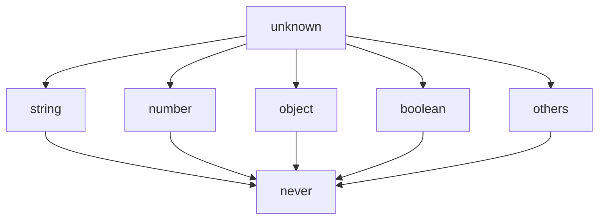

# TypeScript中的子类型

## TypeScript的结构类型系统

常见的面向对象语言，如Java、C#，使用的是名义类型系统，即类型之间的子类关系是用户使用继承显式定义的。
但是在TypeScript中，子类型关系却是根据对象的结构来定义的。

<!-- 在 TAT 中，我们也希望实现结构类型系统。即类型之间的子类关系是系统自动推出的 -->

在 TypeScript 中的类型系统，是基于结构子类型的，如下。

```typescript
interface Named {
  name: string;
}
class Person {
  name: string;
}
let p: Named;
// 不会有类型错误，因为使用了结构类型系统
p = new Person();
```

在使用基于名义类型的语言，比如 C# 或 Java 中，这段代码会报错，因为 Person 类没有明确说明其实现了 Named 接口。
TypeScript 的结构性子类型是根据 JavaScript 代码的典型写法来设计的。因为 JavaScript 里广泛地使用函数表达式和对象字面量，所以使用结构类型系统来描述这些类型比使用名义类型系统更符合JavaScript开发者的直觉。这个设计决策使得TypeScript更容易为JavaScript开发者所接受。

---

## 顶类型和底类型

在TypeScript中，有`unknown`和`never`两个很特殊的类型：

- 对一切类型$S$，都有$S<:$`unknown`。`unknown`叫做顶类型。
- 对一切类型$S$，都有`never`$<:S$。`never`叫做底类型。

若我们使用一个有向图来表示TypeScript中的这种子类型关系，就有：

<div class="ml-15vw">



</div>

之所以将`unknown`叫做顶类型，把`never`叫做底类型，是因为：
它们在子类型关系中分别居于所有类型的顶端和底端。
