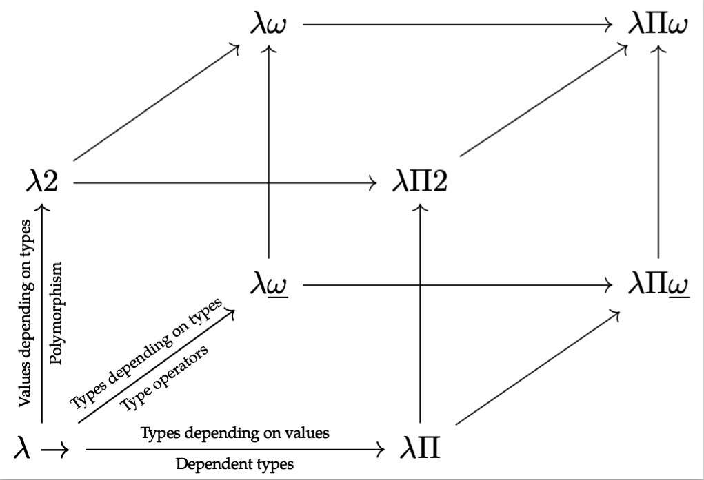

# Lambda Cube

关于类型系统的能力，我们有一个来自纯类型系统(PTS)的能力模型，叫做Lambda Cube。

它有三个维度：是否支持多态(Polymorphism)，是否支持类型算子(Type Operator)，是否支持依值类型(Dependent Type)。

根据类型检查器在STLC的基础之上又增加了哪些能力，我们以STLC为原点，一共可以得到8个顶点，每个顶点代表一类类型检查器的能力。需要注意的是，子类型其实不在Lambda Cube的能力考察范围中。

从Lambda Cube的角度出发，TAT-Sub-F现在处于$\lambda2$这个位置，TypeScript处于$\lambda \omega$。