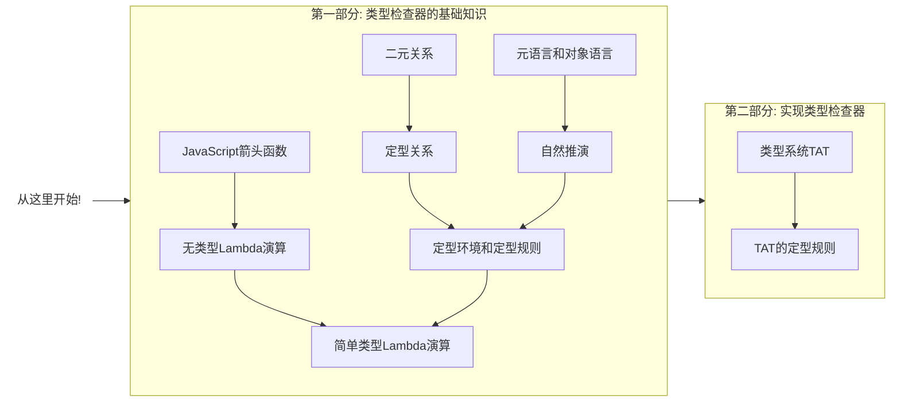

# 类型系统入门

吴登轲 高洁璇

---
layout: section
---

# 第一节：类型系统简介

---
layout: statement
---

## 直觉中的类型

---
layout: statement
---

## 命题 1：自然数 997 是一个质数。

---
layout: statement
---

## 命题 2：自然数 997 是一个跑。

---

# 自然语言中的类型

在知道类型系统的定义之前，我们其实都已经是汉语这门自然语言中的「类型」专家了。

<!-- 汉语是一种自然语言。

- 汉语的词性包括：动词，名词，形容词，副词……它们其实就是「词语」组成的集合，它们是词语的类型。

- 第一句话是一个正确的命题。我们稍微修改一下这句话，得到第二句话。本应该是名词待的位置，却被替换成了动词，让这个句子失去了合法性。 -->

<br>

> 例 1：997 是一个质数。

> \*例 2：997 是一个跑。

<br>

-   如果我们来判断这句话第二句话是否正确，我们可以立刻下结论——它是错的——而不用去理解这个命题涉及的任何数学概念。因为这句话在**语法**上就是错的。这其实就是一种类型检查。

<!-- TODO: 从和编程语言的对应上来说，semantic-selection 其实才是类型检查……需要修改例子和文案 -->

<br>

那么，在编程语言这个形式系统里，我们是不是也可以有类似的快速「检查」？

——这样，我们可以用很低的成本来验证程序是否是对的，而不需要去跑程序本身。

---

# 编程语言中的类型

##

在一些编程语言中，变量的类型可以在运行程序之前就能确定下来。具有这种性质的语言，叫做静态类型语言；反之，则叫做动态类型语言。

```cpp
// CPP 是一门静态类型语言
int a = 10;
a = 'b'; // 会在编译时报错
```

```js
// JavaScript 是一门动态类型语言
let a = 10;
a = 'b'; // 完全合法
```

而有一些编程语言当中，表达式类型之间的转化需要显式地进行，锱铢必较。

这种语言，叫做强类型语言(Strongly-typed Languages)；

反之，那些类型之间的转化大都可以隐式进行的，叫做弱类型语言(Weakly-typed languages)。

> 注意：强弱类型其实是一个比较主观的概念，并没有非常严格的定义。

---
layout: statement
---

## 什么是类型系统？

---

# 类型系统的基本概念

-   一个**值 (Value)**，就是某个东西。它既可以是一个直观上的概念，也可以被解读为编程语言中的**项**。

-   一个**搜集 (Collection)**，就是一堆东西组成的整体。它是一个直观上的概念。

<!-- TODO: 注释一下为啥不用一个更严格的词 -->

-   一个**类型 (Type)**，就是一个由**值**组成的**搜集** [^ts] （你可以直观地认为类型就是一个值组成的**集合**)。

    -   在编程语言中，**一个表达式的类型**就是它在执行之时估计会取到的值形成的一个 **搜集** [^ts]。

## 什么是类型系统？

在编程语言中，**类型系统 (Type System)** 就是一个**类型规则的搜集**，这种规则能为项确定类型。

这些规则都是如果 A，则 B 的形式。例如：如果`a: number, b: number`，那么`(a+b): number`。

<!-- # 类型系统背后的理论：类型论 -->
<!-- 编程语言是一种形式系统。而 **类型论 (Type Theory)** 作为编程语言的类型系统后的理论基础，则有更广的对象：它是关于所有形式系统中的项的类型的学术化的研究 [wiki]。 -->

<!-- ## 类型论的历史 -->

<!-- 类型论 (Type Theory) 从 20 世纪初期发端。…… -->

<!-- ## 什么是类型系统？

"A type system is a tractable syntactic method for proving the absence of certain program behaviors by classifying phrases according to the kinds of values they compute." - [^tapl] -->

[^ts]: [Type Systems](http://lucacardelli.name/papers/typesystems.pdf)

---
layout: statement
---

## 为什么要用类型系统？

---

# 为什么要使用类型系统？

##

-   在计算机科学和软件工程中，我们可以用形式化方法(formal methods)来检查一个软件或是硬件系统是否满足某种性质。例如：

    1. 将芯片设计抽象为模型(model)，使用模型检查器(model checker)证明它的行为符合规范[^tapl];

    2. 使用$\pi$-演算来描述一个并发系统的行为[^2]，证明它不会出现死锁；

    3. 使用证明助手 Coq，来构建形式化的证明，从数学上证明星载实时操作系统 SpaceOS 的内核设计符合一些性质[^1]。

-   类型系统，以及类型检查，可以看成是一种轻量的形式化方法 (formal method)，它也是一种验证软件**性质**的手段[^tapl]。 我们想要的**性质**，一般就是程序不会出某些运行时错误。

[^tapl]: [Benjamin C. Pierce. 2002. Types and Programming Languages (1st. ed.). The MIT Press.](https://dl.acm.org/doi/book/10.5555/509043)
[^1]: 顾海博, 付明, 乔磊,等. SpaceOS 中若干全局性质的形式化描述和验证[J]. 小型微型计算机系统, 2019, 40(1):8.
[^2]: 焦文品, 史忠植. 形式化多主体系统中的交互及交互协议[J]. 软件学报, 2001.

<style>
.footnotes-sep {
  @apply mt-0 opacity-10;
}
.footnotes {
  @apply text-sm opacity-75;
}
.footnote-backref {
  display: none;
}
</style>

---
layout: statement
---

## 类型系统有哪些好处？

---

# 类型系统能帮我们发现错误

<br>

<div grid="~ cols-2 gap-2">

```ts {monaco}
type Status = 'finished' | 'unfinished';

const StatusDisplayDict: Record<Status, string> = {
    finished: '已完成',
    unfinished: '未完成',
};
```

```ts {monaco}
type Status = 'finished' | 'unfinished' | 'processing';

const StatusDisplayDict: Record<Status, string> = {
    finished: '已完成',
    unfinished: '未完成',
};
```

</div>

---

# 类型系统能帮我们发现错误（续）

```ts {monaco}
type MyEvent = { kind: 'resize'; hw: [number, number] } | { kind: 'select'; keys?: string[] };
// @ts-expect-error
function badHandleEvent(e) {
    // 这里不小心少考虑了几种情况……
    const keysHash = [...e.keys].sort().join('#');
    console.log(`keys' hash is: ${keysHash}`);
}
function goodHandleEvent(e: MyEvent) {
    if (e.kind === 'resize') {
        const [h, w] = e.hw;
        console.log(`area: ${h * w}`);
    } else if (e.kind === 'select') {
        if (e.keys) {
            const keysHash = [...e.keys].sort().join('#');
            console.log(`keys' hash is: ${keysHash}`);
        } else {
            console.error('selected, but nothing selected!');
        }
    }
}
```

<style>
iframe{
  height: 380px !important;
}
</style>

---

# 类型系统能提供抽象机制

类型系统不止可以用于发现错误。

## 建立模块抽象

-   不同的模块之间产生交互时，只需用约定接口类型，即可各自开发。

-   可以快速地通过模块导出的类型了解模块的功能。

## 建立领域模型

可参考前一页的代码。「**类型、领域、代码同构**」。类型其实也是一种对领域进行建模、对业务进行建模的手段。

---

# 类型系统能提供文档能力

类型就是比自然语言更加精确的文档。

不必写注释明说如何使用`add`函数。用心去感受……

```ts {monaco}
function add<A extends string, B extends string>(first: A, second: B): `${A}${B}`;
function add(first: number, second: number): number;
function add(first: unknown, second: unknown): unknown {
    return ((first as any) + second) as any;
}

add('1', 2); // 类型错误
add('1', 2 as string); // 类型错误
add('1', '2'); // 正确
add(1, 2); // 正确
```

<style>
iframe {
  height: 380px !important;
}
</style>

---

# 类型系统能提供文档能力（续）

类型就是比自然语言更加精确的文档。

可以用类型系统做流程控制。例如，限制代码必须无 lint 错误才能提交。

```ts {monaco}
type Code = { fileList: string[]; addedTime: Date };
declare const LintInternalSymbol: unique symbol;
type Linted<T> = T & { [LintInternalSymbol]: undefined };
declare function lint<T extends Code>(code: T): Linted<Code>;
declare function commit(code: Linted<Code>): Promise<void>;

declare const code: Code;

commit(code);

commit(lint(code));
```

<br>

在 TypeScript 的结构化定型的类型系统中，往对象上添加元信息来模拟 **名义类型** (Nominal Type)的这种技巧俗称"打标"(Tagging)。

<style>
iframe{
  height: 280px !important;
}
</style>

---
layout: statement
---

## 为什么要学习类型系统？

---

# 为什么要学习类型系统？

-   入门类型论，提高理论水平，为之后在类型系统以及编程语言上的探索打下基础；

-   俯瞰各个语言的类型系统；

-   对 TypeScript 的类型系统产生更深的理解，在日常工作中，写出质量更高的程序；

-   写一个自己的类型检查器，并且能够添加自己想要的特性；

-   ...

---

# 课程介绍

-   本课程主要面向有一定经验的 TypeScript 用户，对于没有 TypeScript 经验的学习者，可以在先学完 TypeScript 课程再来学习本课程。

-   本课程不预设学习者有特别的数学背景，尽量简化用到的数学知识，并会对学习者可能不熟悉的数学知识进行及时的介绍。但是，学习者应当熟悉高中数学涉及到的命题逻辑(比如，$\land$, $\lor$, $\lnot$, $\forall$)以及简单的集合论等相关知识。

-   本课程的一大特色就是**产出导向**。每一节课之后，都设有需要动手编码的小作业。如果你完成了每节课后的作业，那么你最终就能得到一个属于自己的，理论能力和 TypeScript 一样强大的类型检查器，且有一个**图灵完备**的类型系统。这意味着你可以在编译期而非运行时实现一个图灵机。

---

# 课程路线图

### 第二节：类型检查器基础

-   $\lambda$-演算；类型；类型的集合模型；函数类型；元语言和目标语言；定型；定型环境；二元关系；定型关系；定型规则；自然演绎；类型系统的完备性以及可靠性。
-   在这一节的作业要求你实现一个有着最基础类型的类型检查器。

### 第三节：子类型理论以及实现

-   子类型关系；里氏替换原则；子类型的集合模型；函数的逆变、协变、不变。
-   这一节你将往类型检查器中加入子类型这个特性。

### 第四节：多态理论以及实现

-   泛型；子类型多态；特设多态；参数多态；let 多态；顶类型和底类型；全称量词和全称类型；extends 关键字；类型参数。
-   这一节你将往类型检查器中加入泛型。

---

# 课程路线图（续）

### 第五节：递归类型理论以及实现

-   $\mu$-构造器；链表、树的递归类型定义；有类型的 Y 组合子。
-   在这一节，你将往类型检查器中加入对递归类型的支持。

### 第六节：总结和展望

-   类型检查器成品回顾；TypeScript 的类型体操以及例子；柯里霍华德同构。
-   在这一节，你将使用你自己写的类型检查器解决一系列有挑战性的问题，并了解这个玩具类型检查器还有什么特性可以添加。

---
layout: statement
---

## 我们在哪里？

---

# 类型论的大图景

##

类型论(Type Theory, TT)是类型系统背后的理论。

在理论计算机科学(Theoretical Computer Science, TCS)的编程语言理论(Programming Language Theory, PLT)中，它是一个重要话题。

TCS 中的 TT 主要有两个分支：

1. TT 在编程语言中的应用。这表现为编程语言的类型系统。TypeScript 就是一个类型系统的非常好的应用；
2. 纯类型系统(Pure Type System, PTS)。这个分支比较偏向理论，并不关注它在工业界的应用。但是编程语言的设计也时常能够从中汲取一些营养。

<!-- # 纯类型系统

##

PTS主要研究有类型$\lambda$-演算。在简单类型$\lambda$-演算(Simply Typed Lambda Calculus, STLC)的基础上，组合三种正交的特性，我们可以得到8种不同的$\lambda$-演算的变体，从而画出如下类似立方体的图案。它叫做$\lambda$-cube。


这三种能力分别是：多态($\uparrow$)，类型操作符($\nearrow$)， 依值类型($\rightarrow$)。我们在这个课程中，将要构建出有其中两种特性（和TypeScript相同）的类型检查器，对应图中的$\lambda\omega$。 -->

<!-- lambda cube -->
<!-- https://twitter.com/cattheory/status/984976270772654080 -->

---

## 参考文献

[Type Systems](http://lucacardelli.name/papers/typesystems.pdf)

[Benjamin C. Pierce. 2002. Types and Programming Languages (1st. ed.). The MIT Press.](https://dl.acm.org/doi/book/10.5555/509043)

---

## 延伸阅读

[Lambda cube and dependent types](https://www.math.nagoya-u.ac.jp/~garrigue/lecture/2018_tenbo/dependent.pdf)

---
layout: section
---

# 第二节：类型系统的基础

---

# 本节路线图

<div class="mt-3.5rem -ml-2rem">



</div>

---


# 目标类型系统：TAT

## 名字的由来

在这个课程中，我们会实现一个自己的类型检查器，我把它叫做**TAT**(发音:/tæt/)。没有什么特别的原因，只是因为它像一个哭脸的颜文字 😭，而且是个回文串，非常有意思。

## 它的特性

- 它的基本类型命名会尽量避免和JavaScript已经有的类型名字冲突。比如，我们会用`Num`来表示TAT中的数字类型，而不是`number`。`number`会用来特指JavaScript或者TypeScript中的数字类型。

---
layout: statement
---

## 第一部分：类型检查器的基础知识

---
layout: statement
---

## 熟悉描写类型系统的工具

### 元语言和对象语言

### 二元关系和$n$元关系

### 定型关系

---

## 元语言和对象语言

我们可以广义地将一些带有规则的元素称为语言。而我们在研究形式语言的时候，经常需要用另外一种语言描述所研究的那门语言。
研究编程语言时，我们更是经常需要用另外一套记号，来描述编程语言本身。

下面，是MDN上关于JavaScript中`Array.prototype.reduce`的语法的描述。

```js
arr.reduce(callback(accumulator, currentValue[, index[, array]])[, initialValue])
```

下面这些记号，都不是JavaScript的一部分，而只是起到了描述语法模式的作用：
- `arr, callback, accumulator, currentValue, index, array, initialValue`；
- 用来表示可选的`[]`，以及`callback`中用来表示函数参数的`()`。

之所以说它是模式描述，是因为我们在真实调用的时候，不一定非得传入完全相同的名字的参数，只要匹配上了这个模式就行。比如，这样也是完全可以的：

```js
[1,2,3].reduce((acc, cur, ind,) => acc + cur + ind, -1)
```
像这样用来描述一种语言的语言，是**元语言**(Meta Language)。被描述的语言，则是**对象语言**(Object Language)。

---

## 熟悉元语言和元变量

"元语言"和"对象语言"这两个词，只是对于语言在发挥其作用时，所处的地位的描述。

下面是几个元语言的例子。

1. BNF(Backus-Naur Form，或Backus Normal Form)。
  BNF是一种上下文无关的形式语言，它可以用来描写任何一种上下文无关语言的语法——包括它自己。

  下面，我们用BNF定义了简单的算术表达式语言。此时BNF是元语言，被刻画的算术表达式语言是对象语言。

```bnf
<Digit> ::= "0" | "1" | "2" | "3" | "4" | "5" | "6" | "7" | "8" | "9"
<Expr>  ::= <Expr> "-" <Expr> | <Expr> "+" <Expr> | "(" <Expr> ")" | <Digit>
```

`0`, `1+2`, `(1+2)`, `1-(2-3)`, `(1-2)-3`都是合法的表达式。

像`<Digit>`和`<Expr>`这样的，能指代一系列对象语言符号中的元语言符号，也被称为**元变量**(Meta Variable)或者**非终止符**(Nonterminal)。

<div v-click>

- 带有"元"这个前缀，是因为它不存在于对象语言之中，而存在于元语言中。`<Digit>`不是一个算术表达式。
</div>

<div v-click>

- 叫做"变量"，是因为它可以被"赋值为"它所指代的任何一个对象语言符号，而不是特定的对象语言符号。
</div>


---

## 熟悉元语言和元变量（续）

<div class="mt-10px"></div>

2. `Array.prototype.reduce`语法的描述语言。我们将其语法高亮着色：其中<span class="text-rose-400">粉色</span>的是元变量，<span class="text-blue-400">蓝色</span>的是居于辅助地位的元变量。而剩下的是对象语言的符号。

<div class="mt-10px mb-20px">
<code>
<span class="text-rose-400">arr</span>.reduce(<span class="text-blue-400"><span class="text-rose-400">callback</span>(<span class="text-rose-400">accumulator</span></span>, <span class="text-blue-400"><span class="text-rose-400">currentValue</span>[,<span class="text-rose-400">index</span>[, <span class="text-rose-400">array</span>]])[, <span class="text-rose-400">initialValue</span>]</span>)
</code>
</div>

3. 汉语。我们用汉语谈论JavaScript语法或者TAT的语法的时候，汉语就是元语言，被谈论的语言就是对象语言。在用谈论汉语本身的时候，汉语也是对象语言。比如，"形容词"这个术语就是一个元变量。

特别注意：元变量一般会避免取为对象语言中的符号，否则会给读者带来混乱。

---

## 二元关系

在刻画集合内的元素之间的关联的时候，**关系**(Relation)是一个有力的工具。

定义：若集合$R$满足$R\subseteq S\times S$，那么$R$就是一种集合$S$上的二元关系(Binary Relation)。

二元关系的例子：自然数集$\N$上的**小于**关系$R$，即我们通常所知的"$<$"。

$$
\begin{align}
R & := \{(0, 1), (0, 2), \dots, (1, 2), \dots \}, 或等价地 \\
R & := \{ (n, n+m) : n\in \N, m\in \N^+ \}
\end{align}
$$

关于记号的一些说明：

<div v-click>

- $:=$ 符号是一种特殊的等号，它表示将这个等式的左边的表达式定义为右边的表达式。
 </div>
 <div v-click>

- $\{ n : n\in \N \}$是 $\{n\mid n\in \N\}$的另外一种写法，也是一种可接受的集合记号。它用$:$代替了$\mid$，书写更加方便，我们会全部使用前者。
 </div>

---

## 二元关系（续）

<iframe class="w-full" src="https://q.uiver.app/?q=WzAsNSxbMSwwLCIxIl0sWzIsMCwiMiJdLFszLDAsIjMiXSxbMCwwLCIwIl0sWzQsMCwiXFxjZG90cyJdLFswLDFdLFszLDBdLFsxLDJdLFszLDEsIiIsMCx7ImN1cnZlIjotMn1dLFswLDIsIiIsMSx7ImN1cnZlIjotMn1dLFszLDIsIiIsMSx7ImN1cnZlIjotNX1dLFsyLDRdLFsxLDQsIiIsMSx7ImN1cnZlIjoyfV0sWzMsNCwiIiwxLHsib2Zmc2V0IjoyLCJjdXJ2ZSI6NX1dLFswLDQsIiIsMSx7ImN1cnZlIjo0fV1d&embed" width="788" height="286" style="border-radius: 8px; border: none;transform:scale(0.8);"></iframe>

自然数集上的小于关系，$R := \{ (n, n+m) : n\in \N, m\in \N^+ \}$
可以省略地画成这样。

1. 可以看到，有小于关系的两个数$x, y$都有一根有向箭头连接。
2. 我们会说$(0, 1)\in R$或者使用**中缀**的写法，写成$0R1$。

---

# $n$元关系

##

二元关系其实只是$n$元关系($n\in \N$)的特例。而关系也可以定义在**自然数个集合**之上。

-   二元关系。整除关系。

    $$
    \text{Divides} := \{ (n, m) : n\in \N^+, m\in \N, m\bmod n = 0 \}，其中 \\
    $$

    $x\bmod y = k$ 表示 $x$ 被 $y$ 除余 $k$。

-   一元关系。是否是偶数。

    $$
    \begin{align}
    \text{IsEven}:=\{0,2,4,6 \dots\}=\{n: n\in \N, 2\ \text{Divides}\ n\} \subset \N
    \end{align}
    $$

    一元关系也叫做一元**谓词**(Predicate)。谓词也可以看成是接受若干个元素，返回`true`或者`false`的函数。

---

# $n$元关系（续）

<!-- - 三元关系。
$$
\begin{align}
\text{SumEquals} & := \{(0,0,0), (0,1,1), (0, 2, 2), \dots, (1, 0, 1), \dots \} \\
                 & = \{(n, m, k) : n\in \N, m\in \N, k\in \N, n+m=k\}
\end{align}
$$ -->

-   三元关系。
    $$
    \text{ASCII} = \{(\texttt{A}, 65, \text{0x41}), (\texttt{B}, 66, \text{0x42}),\dots \} \subset \text{Letter}\times \Z \times \text{HexNumber}
    $$

在本课程中，我们会主要使用二元关系和三元关系。它们是我们刻画**项**、**类型**、**定型环境**之间关系的有力工具。

注意：关系的数学本质仅仅是一个集合。定义哪些元素之间存在关系的时候完全是任意的。不必像我们刚刚看的那些例子一样，非得将每个关系都解释出现实意义不可。

<div v-click class="my-10 text-center">
练习：请各举出一个二元关系和四元关系的例子。
</div>

---

## 作为二元关系的定型关系

如同我们在 TypeScript 中做的那样，在类型系统的文献中，我们会将一个项$t$以及这个项的类型$T$的关系，记做一个中缀表达式

$$
t:T
$$

其中，"$:$"是一个将项和类型连接的符号。 这里的$t$是一个元变量，它指代的是类型系统中的某一个项；$T$也是一个元变量，它指代的是类型系统中的一个类型。

因为这个关系涉及项和类型两个元素，因此它是一个二元关系。这个关系就是**定型关系**(Typing Relation)。

我们通常会把定型关系解读为「项$t$是一个类型$T$」(term $t$ is of type $T$, or $t$ is a $T$)。比如$\text{🍎}: 水果$就可以解读为，🍎是一个水果，或者是🍎是一个水果类型的实例。

「水果」可以看成是一个集合，其中包含了一切水果，因此我们也可以说

$$\text{🍎} \in \text{水果}$$

---
layout: section
---

## 建立基础定型规则

### 自然推演和导出树

### 定义基础类型：数字(`Num`)、字符串(`Str`)、布尔(`Bool`)

---

## 用自然推演来书写定型规则

接下来，我们开始逐渐往TAT中添加类型，丰富这个类型系统。 我们首先加入`Num`这种类型。

对于二元的加法`+`来说，我们有：

$$
{x: \mathbf{Num},\ y: \mathbf{Num} \over x + y : \mathbf{Num} }\ (\text{N-Add})
$$

- 每个推演规则，都由横线上下分割。

- 在横线之上的，是使用这条规则的前提；横线之下的，是在前提满足的情况下，使用这条规则能得到的结论。 

- 横线右边的，是出于便于讨论的目的，给这条规则取的名字。这条规则叫做`N-Add`。


`N-Add`这个规则的意思是说：若`x`的类型是`Num`，`y`的类型是`Num`，那么`x+y`也是`Num`。

这种写法，叫做**自然推演**(Natural Deduction)。

---

# 使用自然推演来构造导出树

##

### 问题

若已知 `x: Num`, `z: Num`，`y: Num`, 那么`x+z+y`是什么类型呢？

### 思路

1. 我们的`+`如同JavaScript中的`+`一样是左结合的，也就是说$x+z+y$等价于$(x+z)+y$。
2. 那么，我们只需要知道$x+z$是什么类型，就可以知道$x+z+y$是什么类型……

### 解法

$$
\frac{
  \frac{ \displaystyle x:\ \mathbf{Num}, z:\ \mathbf{Num}}{ \displaystyle x+z:\ \mathbf{Num} } \qquad {y:\ \mathbf{Num}}
} {
  (x+z)+y:\ \mathbf{Num}
}
$$

可以看到，我们将多次应用规则$\text{N-Add}$和其他已知前提，最终得到`x+z+y: Num`的推演过程组织成了一棵树。
它叫做导出树(Derivation Tree)。同时，因为这棵树也构成了一个对`x+z+y: Num`的证明，因此它也叫做证明树(Proof Tree)。
**类型检查，就是隐式地构造这棵导出树，或者检查这个导出树是否正确**。

---

# 类型系统中缺少的一环

##

### 问题

N-Add 规则告诉我们，如果我们知道`+`的两个操作数的类型都为`Num`，那么我们就知道这个表达式的结果也为`Num`。
但是，这个规则并没有告诉我们，TAT 中什么样的项，才是`Num`类型的实例。

$$
{x: \mathbf{Num},\ y: \mathbf{Num} \over x + y : \mathbf{Num} }\ (\text{N-Add})
$$


形式化地来说，下面这个式子横线之上的`???`部分，需要填上些什么呢？

$$
{??? \over x: \mathbf{Num}}
$$

<!-- 我们都知道，`1`和`2.0`乃至`-1e15`都是 JavaScript 中的`number`类型的实例。我们希望 TAT 中的`Num`类型和 JavaScript`number`类型相同，那么`1`和`2.0`乃至`-1e15`也都是`Num`类型的实例。 -->

### 思路

我们尚未有任何根据来判断在TAT中一个项是不是`Num`类型！ 在TAT中，我们可以说对JavaScript的语法一无所知，而一个项是否是`number`的实例，却正与JavaScript语法紧密相关。或许我们应该去求助JavaScript的语法？

---

## 利用类型系统之外的结构来定义基础类型

### 解法

而在JavaScript当中，通过语法分析得到的AST节点恰好有NumberLiteral (数字字面量)这种语法类别(Syntax Kind)，完全符合JavaScript对`number`类型实例的定义。
因此，我们可以将具有NumberLiteral这种类型的节点对应的项，`Num`类型的实例。

若`x`为TAT中的项，$\bar{x}$是这个项对应的语法树上的节点，$\text{IsNumberLiteral}$是parser提供的判断一个语法树节点是否为NumberLiteral的谓词，那么`x: Num`的规则如下。由此规则，我们可以得到`1: Num`，`0.2: Num`，`-1e15: Num`等等结果。

$$
{\text{IsNumberLiteral}(\bar{x}) \over x: \mathbf{Num}}
$$


### 类比

同样地，我们可以利用AST上的节点的语法类别，继续扩张TAT的基本类型：

<div v-click class="-mt-10px">

- 定义布尔值字面量为`Bool`类型；
</div>

<div v-click>

- 字符串字面量为`Str`类型；
</div>

<div v-click>

- 函数为`Func`类型……？似乎没有那么简单！
</div>

---
layout: section
---

## 定义函数类型

### 定义函数类型的尝试

### 定型环境

### 作为三元关系的定型关系

### 无类型$\lambda$-演算和有类型$\lambda$-演算

---

## 如何定义函数类型？

问：TAT的函数类型，就叫做`Func`好了，我们要如何从语法上定义这个类型？

### 思路

<div v-click>

- 尝试1：**继续用语法树上的节点类别来判断**。节点类别有数字字面量、布尔值字面量、字符串字面量，当然也有函数。能不能将函数节点对应的项，认为是`Func`类型的实例呢？

$$
{\text{IsFunction}(\bar{x}) \over x: \mathbf{Func}}
$$
</div>

<div v-click>

- 失败1：如果有`f: Func, x: Num`，那么试回答：`f`有几个参数，各自的类型是什么，能够接受一个`x: Num`吗？`f(x)`的类型又是什么呢？

  答案是：不知道！ 因为`Func`丢失了我们希望保留的函数入参的类型，和返回值类型。我们无从判断。如果我们接受这种规则，TAT对函数调用的类型正确与否就几乎起不到任何检查作用了。

  所以，若是仅仅只定义一个`Func`类型，而没有关于函数入参和返回值的细节，这种函数类型几乎没有用处。

</div>

---

## 如何定义函数类型？（续）

问：TAT的函数类型，就叫做`Func`好了，我们要如何从语法上定义这个类型？

### 思路

- 尝试2：那么我们只需要把函数多个的参数类型、返回值类型全部放到一个函数实例的类型中就行了。JavaScript的箭头函数语法简洁而优美，我们可以对箭头函数的语法略微修改，用来标记一个函数的类型。这条路似乎能行！对于`x => x + 1`来说，我们可以给`x`这个变量手动标注上类型，得到`(x: Num) => x + 1`。

- 出问题了：`x + 1`中，`x`的类型是什么？ 我们其实并不知道变量`x`的类型！我们现在只知道类似`1: Num`、`0.2: Num`这样光从语法层面就能得到的结果，尚未把这种针对变量的手工类型标注引入成为已知条件。

为了**引入**变量的手工类型标注，我们需要从根本上修改定型关系，使得TAT能够把`x: Num`这个手工类型标注，看做已知条件。


---

## 定型环境

在引入了函数之后，TAT中出现了变量的概念。比如：

```typescript
(x: Num) => (y: Str) => x + y
```

这里的`x`就是变量，而不是形如`1`这样的常量。`x: Num`意味着在运行的时候，这个`x`会被赋值为一个`Num`类型的实例，同理`y`就会被赋值为一个`Str`类型的实例。

为此，我们需要引入「定型环境(Typing Environment)」这个概念。
所谓的定型环境，就是一个存储当前作用域内变量的类型的一个列表。

一般来说，它会是形如$x: X$的类型信息形成的列表，只不过这个列表和我们在JavaScript里见到的形式有点区别，它没有方括号包裹。例如，在检查`x + y`这个表达式的时候，定型环境可以是：

$$
\Gamma = 
  x: \text{Num},
  y: \text{Str}
$$

空的定型环境用$\varnothing$(空集符号，$\LaTeX$:`\varnothing`)表示；定型环境之间、单个二元定型关系之间，可以用逗号连接，形成新的定型环境。比如$\Gamma, z: \text{Num}$就等于$x: \text{Num},y: \text{Str}, z: \text{Num}$。

---

## 作为三元关系的定型关系

有了定型环境，我们也要对二元定型关系作些许的修改，将它们转换成三元定型关系：

$$
\Gamma \vdash t: T
$$

"$\vdash$" ($\LaTeX$:`\vdash`) 的左边是一些前提，右边是形如$t: T$的结论。
它的意思是说，**在定型环境$\Gamma$(Gamma)下，我们可以通过应用一些推演规则，推演出项$t$的类型是$T$这个结论**。

$\vdash$的左侧为$\varnothing$时，通常略去不写，如：

$$
\vdash 1: \text{Num}
$$

$\vdash$也可以在一行内连续使用，比如：

$$
\vdash 1: \text{Num} \vdash \text{true}: \text{Bool}
$$

上面这个式子，等价于在说$\vdash 1: \text{Num}$且$1: \text{Num}\vdash \text{true}: \text{Bool}$。

上面给出的两个式子在TAT中都是正确的，我们之后会证明。

---

## 无类型$\lambda$-演算：JavaScript函数背后的理论模型

现代编程语言的函数，本质上其实是对$\lambda$-演算的一种模仿。自从20世纪30年代Alonzo Church发明了$\lambda$-演算之后，它的简洁、优美、深刻，吸引了无数人。下面是$\lambda$-演算的一个例子，**Y组合子**(Y Combinator)：

$$
\lambda f.\ (\lambda x.\ f\ (x\ x)) (\lambda x.\ f\ (x\ x))
$$

在现代编程语言中，$\lambda$-演算摇身一变，成为了Lambda 表达式。我们可以看到，Lambda 表达式能让函数的定义变得简洁而优美，这使得包括Java, C++, C#, Python, Ruby, Rust, GoLang在内的各路编程语言纷纷引入了它。
而JavaScript也不例外。Lambda表达式在ES6中正式引入，叫做箭头函数。

有类型$\lambda$-演算，构成了类型论研究的基石。

通过研究一个最小化的模型，我们更容易地可以建立起对更加复杂的事物的原理的深刻认识。
类型系统中函数的研究，离不开这个最小化的计算模型。
而为了更好地定义TAT的函数类型，我们需要研究一下最基本的$\lambda$-演算，及其有类型的变体：

<div v-click>

- 无类型$\lambda$-演算(UTLC, Untyped Lambda Calculus)，和其**有类型**的变体
</div>

<div v-click>

- 有类型$\lambda$-演算(STLC, Simply Typed Lambda Calculus)。
</div>

---


## 初识无类型$\lambda$-演算

**无类型$\lambda$-演算**(UTLC, Untyped Lambda Calculus)，是一种非常重要的、图灵完备计算模型。
**无类型**指的是我们现在考虑的$\lambda$-演算还没有类型系统。

### 概念

1. 变量(Variable)。$x$, $y$, $z$……

2. 抽象(Abstraction)。构造一个函数，并且以变量为参数。如下，其中`.`之前的$x$就是函数的参数。`.`之后的就是函数体。这个例子定义了一个返回值为入参加1的函数。

$$
\lambda x. x+1
$$

3. 应用(Application)。定义了函数，自然就可以调用。如下，将2作为这个函数的参数调用。函数的返回值是3。

$$
(\lambda x. x+1)\ 2
$$

在这门课程中，我们不会对$\lambda$-演算下一个形式定义，你只需要将它类比成 JavaScript 中的箭头函数即可。这样大多数关于箭头函数的直觉都可以沿用下来。

---

## JavaScript 口味的无类型$\lambda$-演算

下面是一些$\lambda$-演算和 JavaScript 中的对应物的例子。其中，`=>`是右结合的，因此`x => y => x + y`等价于`x => (y => x + y)`。

<div grid="~ cols-2 gap-2">

```php
λx.x+1
λx.λy.x+y
(λx.λy.x+y) 1 // 得到一个函数 λy.y+1
(λx.λy.x+y) 1 2 // 得到 3
```

```js
x => x + 1;
x => y => x + y;
(x => y => x + y)(1); // 等价于 y=>y+1
(x => y => x + y)(1)(2); // 3
```

</div>

定义一个函数，$\lambda$-演算中叫做抽象；调用一个函数，叫做应用；函数的形式参数叫做变量。

--- 

## 无类型$\lambda$-演算的问题

---

## 简单类型$\lambda$-演算到TypeScript的类型标记

---

## TypeScript 口味的简单类型$\lambda$-演算

我们先回顾一下，在TypeScript中是如何标注一个箭头函数的类型的。

```typescript  {monaco}
((x: number) => x + 1)(1);
((x: number) => (y: number) => x + y)(2)(3);
```

<!-- 接下来，我们来仿照着这种记号，在TAT中定义函数类型。 -->

`number`类型对应着TAT中的`Num`类型。因此，只需要简单地更换类型，我们就得到的合法的TAT代码：

```typescript
((x: Num) => x + 1)(1);
((x: Num) => (y: Num) => x + y)(2)(3);
```

下面这两行代码，就不能通过TAT的类型检查了：
```typescript
((x: Num) => x + 1)("1");
((x: Num) => (y: Num) => x + y)(2)("3");
```

---
layout: section
---

## TAT-LC的定型规则

---
layout: section
---
## 第二部分：实现类型检查器TAT-LC
---

## 实现TAT-LC

---

## 扩展阅读

[让我们来谈谈$\lambda$演算](https://github.com/txyyss/Lambda-Calculus/releases/download/v1.0/lambda.pdf)
