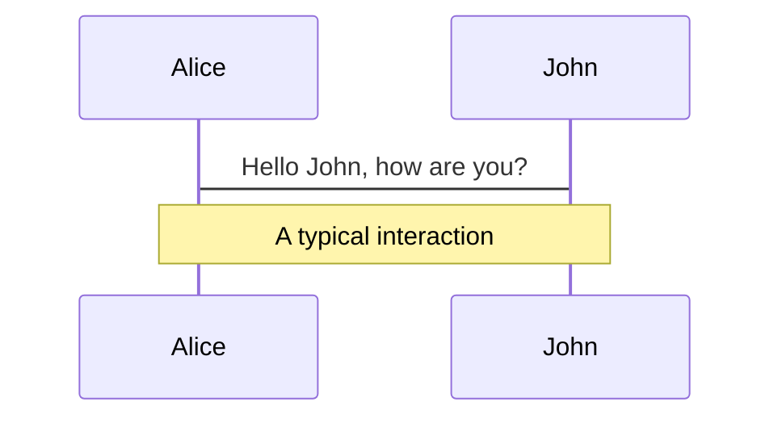
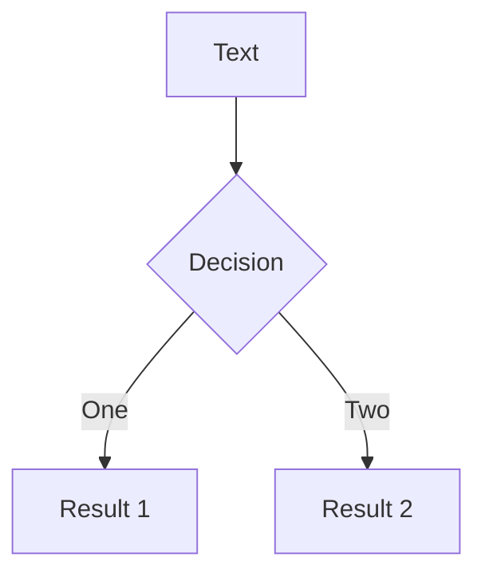

# 类型系统入门

吴登轲 高洁璇

---
layout: section
---

# 第一节：类型系统简介

---
layout: statement
---

## 什么是类型？

---

# 自然语言中的类型

我们其实都已经是汉语这门自然语言中的「类型系统」的专家了。

- 汉语的词性包括：动词，名词，形容词，副词……它们其实就是「词语」组成的搜集，它们是词语的类型。

- 例子：类型错误。第一句话是一个正确的命题。我们稍微修改一下这句话，得到第二句话。本应该是名词待的位置，却被替换成了动词，让这个句子失去了合法性。

<br>

> 997 是一个质数。

> *997 是一个跑。

<br>

- 如果你来判断这句话第二句话是否正确，你可以立刻下结论——它是错的——而不用去理解这个命题涉及的任何数学概念。因为这句话在语法上就是错的。这其实就是一种类型检查。

<!-- TODO: 从和编程语言的对应上来说，s-selection 其实才是类型检查……需要修改例子 -->

<br>

<Center>
 那么，到编程语言这个形式系统上，我们是不是也可以有类似的「类型检查」？
</Center>

---

# 编程语言中的类型

## TypeScript中的类型概览

在TypeScript 4.5中，我们有`number`, `boolean`, `string`, `bigint`, `symbol`，以及`undefined`, `null`[^1]这7个**原始类型(Primitive Type)**，还有`Array`, `Object`, `Function`等等**引用类型**()。

[^1]: `null`和`undefined`可以解释为字面量类型，但是这里还是按照JavaScript的提法，将其同样认为是原始类型。

---

# 语言的分类

```ts {monaco}
type LanguageTaxonomy = ['动态定型' | '静态定型', '强类型' | '弱类型'];
const CPP: LanguageTaxonomy = ['静态定型', '强类型'];
const JavaScript: LanguageTaxonomy = ['动态定型', '弱类型'];
```

在一些编程语言中，变量的类型可以在运行程序之前就能确定下来。这种

```cpp {monaco}
// CPP
int a = 10;
a = 'b'; // 会在编译时报错
```

```js
// JavaScript
let a = 10;
a = 'b'; // 完全合法
```

<!-- 在编程语言中，类型系统提供的能力，可以帮助我们写出更好的程序。 -->

---

# 编程语言为什么要引入类型系统？

## 动机

## 好处

---

# 类型系统的基本概念

- 一个**值 (Value)**，就是某个东西。它是一个直观上的概念。

- 一个**搜集 (Collection)**，就是一堆东西组成的整体。它同样是一个直观上的概念。

<!-- TODO: 注释一下为啥不用一个更严格的词 -->

- 一个**类型 (Type)**，就是一个由**值**组成的**搜集** [^ts] （你可以直观地认为类型就是一个值组成的**集合**)。 

- 在编程语言中，**一个表达式的类型**就是它在执行之时估计会取到的值形成的一个 **搜集** [^ts]。

- 在编程语言中，**类型系统 (Type System)** 就是一个**类型规则的搜集**，这种规则能为每个项确定一个类型。

类型系统其实很难有一个精确的定义。从某个角度可以定义如下：

> A type system is a tractable syntactic method for proving the absence of certain program behaviors by classifying phrases according to the kinds of values they compute. - [tapl]


<!-- # 类型系统背后的理论：类型论 -->
<!-- 编程语言是一种形式系统。而 **类型论 (Type Theory)** 作为编程语言的类型系统后的理论基础，则有更广的对象：它是关于所有形式系统中的项的类型的学术化的研究 [wiki]。 -->

<!-- ## 类型论的历史 -->

<!-- 类型论 (Type Theory) 从 20 世纪初期发端。…… -->

---

# 参考文献

[ts]: http://lucacardelli.name/papers/typesystems.pdf

---

# 为什么要学习类型系统

---

# What is Slidev?

Slidev is a slides maker and presenter designed for developers, consist of the following features

- 📝 **Text-based** - focus on the content with Markdown, and then style them later
- 🎨 **Themable** - theme can be shared and used with npm packages
- 🧑‍💻 **Developer Friendly** - code highlighting, live coding with autocompletion
- 🤹 **Interactive** - embedding Vue components to enhance your expressions
- 🎥 **Recording** - built-in recording and camera view
- 📤 **Portable** - export into PDF, PNGs, or even a hostable SPA
- 🛠 **Hackable** - anything possible on a webpage

<br>

Read more about [Why Slidev?](https://sli.dev/guide/why)

<!--
You can have `style` tag in markdown to override the style for the current page.
Learn more: https://sli.dev/guide/syntax#embedded-styles
-->

<style>
h1 {
  background-color: #2B90B6;
  background-image: linear-gradient(45deg, #4EC5D4 10%, #146b8c 20%);
  background-size: 100%;
  -webkit-background-clip: text;
  -moz-background-clip: text;
  -webkit-text-fill-color: transparent; 
  -moz-text-fill-color: transparent;
}
</style>

---

# Navigation

Hover on the bottom-left corner to see the navigation's controls panel, [learn more](https://sli.dev/guide/navigation.html)

### Keyboard Shortcuts

|     |     |
| --- | --- |
| <kbd>right</kbd> / <kbd>space</kbd>| next animation or slide |
| <kbd>left</kbd>  / <kbd>shift</kbd><kbd>space</kbd> | previous animation or slide |
| <kbd>up</kbd> | previous slide |
| <kbd>down</kbd> | next slide |

<!-- https://sli.dev/guide/animations.html#click-animations -->

<p v-after class="absolute bottom-23 left-45 opacity-30 transform -rotate-10">Here!</p>

---
layout: image-right
image: https://source.unsplash.com/collection/94734566/1920x1080
---

# Code

Use code snippets and get the highlighting directly![^1]

```ts {all|2|1-6|9|all}
interface User {
  id: number
  firstName: string
  lastName: string
  role: string
}

function updateUser(id: number, update: User) {
  const user = getUser(id)
  const newUser = {...user, ...update}  
  saveUser(id, newUser)
}
```

<arrow v-click="3" x1="400" y1="420" x2="230" y2="330" color="#564" width="3" arrowSize="1" />

[^1]: [Learn More](https://sli.dev/guide/syntax.html#line-highlighting)

<style>
.footnotes-sep {
  @apply mt-20 opacity-10;
}
.footnotes {
  @apply text-sm opacity-75;
}
.footnote-backref {
  display: none;
}
</style>

---

# Components

<div grid="~ cols-2 gap-4">
<div>

You can use Vue components directly inside your slides.

We have provided a few built-in components like `<Tweet/>` and `<Youtube/>` that you can use directly. And adding your custom components is also super easy.

```html
<Counter :count="10" />
```

<!-- ./components/Counter.vue -->
<Counter :count="10" m="t-4" />

Check out [the guides](https://sli.dev/builtin/components.html) for more.

</div>
<div>

```html
<Tweet id="1390115482657726468" />
```

<Tweet id="1390115482657726468" scale="0.65" />

</div>
</div>

---
class: px-20
---

# Themes

Slidev comes with powerful theming support. Themes can provide styles, layouts, components, or even configurations for tools. Switching between themes by just **one edit** in your frontmatter:

<div grid="~ cols-2 gap-2" m="-t-2">

```yaml
---
theme: default
---
```

```yaml
---
theme: seriph
---
```


</div>

Read more about [How to use a theme](https://sli.dev/themes/use.html) and
check out the [Awesome Themes Gallery](https://sli.dev/themes/gallery.html).

---
preload: false
---

# Animations

Animations are powered by [@vueuse/motion](https://motion.vueuse.org/).

```html
<div
  v-motion
  :initial="{ x: -80 }"
  :enter="{ x: 0 }">
  Slidev
</div>
```

<div class="w-60 relative mt-6">
  <div class="relative w-40 h-40">
    
    
    
  </div>

  <div 
    class="text-5xl absolute top-14 left-40 text-[#2B90B6] -z-1"
    v-motion
    :initial="{ x: -80, opacity: 0}"
    :enter="{ x: 0, opacity: 1, transition: { delay: 2000, duration: 1000 } }">
    Slidev
  </div>
</div>

<!-- vue script setup scripts can be directly used in markdown, and will only affects current page -->
<script setup lang="ts">
const final = {
  x: 0,
  y: 0,
  rotate: 0,
  scale: 1,
  transition: {
    type: 'spring',
    damping: 10,
    stiffness: 20,
    mass: 2
  }
}
</script>

<div
  v-motion
  :initial="{ x:35, y: 40, opacity: 0}"
  :enter="{ y: 0, opacity: 1, transition: { delay: 3500 } }">

[Learn More](https://sli.dev/guide/animations.html#motion)

</div>

---

# LaTeX

LaTeX is supported out-of-box powered by [KaTeX](https://katex.org/).

<br>

Inline $\sqrt{3x-1}+(1+x)^2$

Block
$$
\begin{array}{c}

\nabla \times \vec{\mathbf{B}} -\, \frac1c\, \frac{\partial\vec{\mathbf{E}}}{\partial t} &
= \frac{4\pi}{c}\vec{\mathbf{j}}    \nabla \cdot \vec{\mathbf{E}} & = 4 \pi \rho \\

\nabla \times \vec{\mathbf{E}}\, +\, \frac1c\, \frac{\partial\vec{\mathbf{B}}}{\partial t} & = \vec{\mathbf{0}} \\

\nabla \cdot \vec{\mathbf{B}} & = 0

\end{array}
$$

<br>

[Learn more](https://sli.dev/guide/syntax#latex)

---

# Diagrams

You can create diagrams / graphs from textual descriptions, directly in your Markdown.

<div class="grid grid-cols-2 gap-10 pt-4 -mb-6">





</div>

[Learn More](https://sli.dev/guide/syntax.html#diagrams)

---
layout: center
class: text-center
---

# Learn More

[Documentations](https://sli.dev) · [GitHub](https://github.com/slidevjs/slidev) · [Showcases](https://sli.dev/showcases.html)