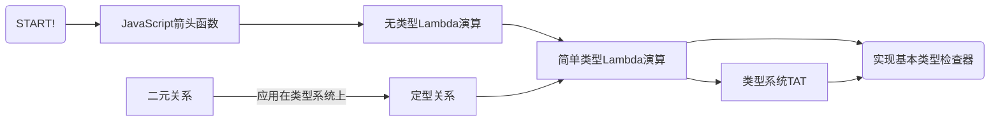
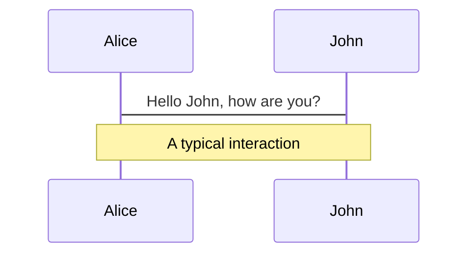
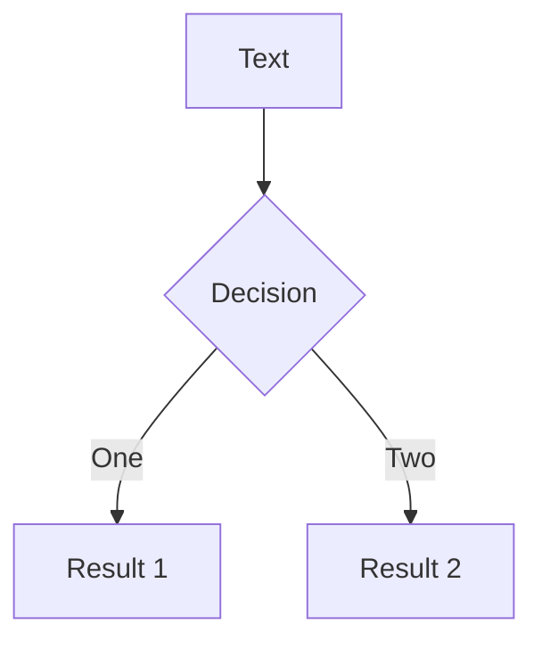

# 类型系统入门

吴登轲

---
layout: section
---

# 第一节：类型系统简介

---
layout: statement
---

## 什么是类型？

---
layout: statement
---

## 命题1：自然数 997 是一个质数。

---
layout: statement
---

## 命题2：自然数 997 是一个跑。

---

# 自然语言中的类型

在知道类型系统的定义之前，我们其实都已经是汉语这门自然语言中的「类型」专家了。

<!-- 汉语是一种自然语言。

- 汉语的词性包括：动词，名词，形容词，副词……它们其实就是「词语」组成的集合，它们是词语的类型。

- 第一句话是一个正确的命题。我们稍微修改一下这句话，得到第二句话。本应该是名词待的位置，却被替换成了动词，让这个句子失去了合法性。 -->

<br>

> 例1：997 是一个质数。

> *例2：997 是一个跑。

<br>

- 如果我们来判断这句话第二句话是否正确，我们可以立刻下结论——它是错的——而不用去理解这个命题涉及的任何数学概念。因为这句话在**语法**上就是错的。这其实就是一种类型检查。

<!-- TODO: 从和编程语言的对应上来说，semantic-selection 其实才是类型检查……需要修改例子和文案 -->

<br>

那么，在编程语言这个形式系统里，我们是不是也可以有类似的快速「检查」？

——这样，我们可以用很低的成本来验证程序是否是对的，而不需要去跑程序本身。

---

# 编程语言中的类型

##

在一些编程语言中，变量的类型可以在运行程序之前就能确定下来。具有这种性质的语言，叫做静态类型语言；反之，则叫做动态类型语言。

```cpp {monaco}
// CPP 是一门静态类型语言
int a = 10;
a = 'b'; // 会在编译时报错
```

```js
// JavaScript 是一门动态类型语言
let a = 10;
a = 'b'; // 完全合法
```

而有一些编程语言当中，表达式类型之间的转化需要显式地进行，锱铢必较。

这种语言，叫做强类型语言(Strongly-typed Languages)；

反之，那些类型之间的转化大都可以隐式进行的，叫做弱类型语言(Weakly-typed languages)。

> 注意：强弱类型其实是一个比较主观的概念，并没有非常严格的定义。

---
layout: statement
---

## 什么是类型系统？

---

# 类型系统的基本概念

- 一个**值 (Value)**，就是某个东西。它既可以是一个直观上的概念，也可以被解读为编程语言中的**项**。

- 一个**搜集 (Collection)**，就是一堆东西组成的整体。它是一个直观上的概念。

<!-- TODO: 注释一下为啥不用一个更严格的词 -->

- 一个**类型 (Type)**，就是一个由**值**组成的**搜集** [^ts] （你可以直观地认为类型就是一个值组成的**集合**)。 

  - 在编程语言中，**一个表达式的类型**就是它在执行之时估计会取到的值形成的一个 **搜集** [^ts]。

## 什么是类型系统？

在编程语言中，**类型系统 (Type System)** 就是一个**类型规则的搜集**，这种规则能为项确定类型。

这些规则都是如果A，则B的形式。例如：如果`a: number, b: number`，那么`(a+b): number`。

<!-- # 类型系统背后的理论：类型论 -->
<!-- 编程语言是一种形式系统。而 **类型论 (Type Theory)** 作为编程语言的类型系统后的理论基础，则有更广的对象：它是关于所有形式系统中的项的类型的学术化的研究 [wiki]。 -->

<!-- ## 类型论的历史 -->

<!-- 类型论 (Type Theory) 从 20 世纪初期发端。…… -->

<!-- ## 什么是类型系统？

"A type system is a tractable syntactic method for proving the absence of certain program behaviors by classifying phrases according to the kinds of values they compute." - [^tapl] -->

[^ts]: [Type Systems](http://lucacardelli.name/papers/typesystems.pdf)

---
layout: statement
---
## 为什么要用类型系统？
---

# 为什么要使用类型系统？

##

- 在计算机科学和软件工程中，我们可以用形式化方法(formal methods)来检查一个软件或是硬件系统是否满足某种性质。例如：

  1. 将芯片设计抽象为模型(model)，使用模型检查器(model checker)证明它的行为符合规范[^tapl];

  2. 使用$\pi$-演算来描述一个并发系统的行为[^2]，证明它不会出现死锁；

  3. 使用证明助手Coq，来构建形式化的证明，从数学上证明星载实时操作系统SpaceOS的内核设计符合一些性质[^1]。

- 类型系统，以及类型检查，可以看成是一种轻量的形式化方法 (formal method)，它也是一种验证软件**性质**的手段[^tapl]。 我们想要的**性质**，一般就是程序不会出某些运行时错误。

[^tapl]: [Benjamin C. Pierce. 2002. Types and Programming Languages (1st. ed.). The MIT Press.](https://dl.acm.org/doi/book/10.5555/509043)
[^1]: 顾海博, 付明, 乔磊,等. SpaceOS中若干全局性质的形式化描述和验证[J]. 小型微型计算机系统, 2019, 40(1):8.
[^2]: 焦文品, 史忠植. 形式化多主体系统中的交互及交互协议[J]. 软件学报, 2001.

<style>
.footnotes-sep {
  @apply mt-0 opacity-10;
}
.footnotes {
  @apply text-sm opacity-75;
}
.footnote-backref {
  display: none;
}
</style>

---
layout: statement
---
## 类型系统有哪些好处？


---

# 类型系统能帮我们发现错误

<br>

<div grid="~ cols-2 gap-2">

```ts {monaco}
type Status = 'finished' | 'unfinished';

const StatusDisplayDict: Record<Status, string> = {
  finished: "已完成",
  unfinished: "未完成",
}
```

```ts {monaco}
type Status = 'finished' | 'unfinished' | 'processing';

const StatusDisplayDict: Record<Status, string> = {
  finished: "已完成",
  unfinished: "未完成",
}
```

</div>

---

# 类型系统能帮我们发现错误（续）


```ts {monaco}
type MyEvent = | {kind:'resize'; hw: [number,number]} 
               | {kind: 'select', keys?: string[]};
// @ts-expect-error
function badHandleEvent(e){
  // 这里不小心少考虑了几种情况……
  const keysHash = [...e.keys].sort().join('#');
  console.log(`keys' hash is: ${keysHash}`);
}
function goodHandleEvent(e: MyEvent){
  if(e.kind === 'resize'){
    const [h,w] = e.hw;
    console.log(`area: ${h*w}`);
  }else if(e.kind === 'select'){
    if(e.keys){
      const keysHash = [...e.keys].sort().join('#');
      console.log(`keys' hash is: ${keysHash}`);
    }else{
      console.error('selected, but nothing selected!');
    }
  }
}
```

<style>
iframe{
  height: 380px !important;
}
</style>

---

# 类型系统能提供抽象机制

类型系统不止可以用于发现错误。

## 建立模块抽象

- 不同的模块之间产生交互时，只需用约定接口类型，即可各自开发。

- 可以快速地通过模块导出的类型了解模块的功能。

## 建立领域模型

可参考前一页的代码。「**类型、领域、代码同构**」。类型其实也是一种对领域进行建模、对业务进行建模的手段。

---

# 类型系统能提供文档能力
类型就是比自然语言更加精确的文档。

不必写注释明说如何使用`add`函数。用心去感受……
```ts {monaco}
function add<A extends string, B extends string>(first: A, second: B): `${A}${B}`;
function add(first: number, second: number): number;
function add(first: unknown, second: unknown): unknown {
  return first as any + second as any;
}


add("1",2);             // 类型错误
add("1",2 as string);   // 类型错误
add("1","2");           // 正确
add(1,2);               // 正确
```
<style>
iframe{
  height: 380px !important;
}
</style>

---

# 类型系统能提供文档能力（续）
类型就是比自然语言更加精确的文档。

可以用类型系统做流程控制。例如，限制代码必须无lint错误才能提交。
```ts {monaco}
type Code = { fileList: string[]; addedTime: Date };
declare const LintInternalSymbol: unique symbol;
type Linted<T> = T & { [LintInternalSymbol]: undefined };
declare function lint<T extends Code>(code: T): Linted<Code>;
declare function commit(code: Linted<Code>): Promise<void>;

declare const code: Code;

commit(code);

commit(lint(code));
```
<br>

在TypeScript的结构化定型的类型系统中，往对象上添加元信息来模拟 **名义类型** (Nominal Type)的这种技巧俗称"打标"(Tagging)。

<style>
iframe{
  height: 280px !important;
}
</style>

<!-- ---

# 类型系统能提供语言安全性

这里需要一些例子。 -->

<!-- TODO -->

---
layout: statement
---

## 为什么要学习类型系统？

---

# 为什么要学习类型系统？

- 入门类型论，提高理论水平，为之后在类型系统以及编程语言上的探索打下基础；

- 俯瞰各个语言的类型系统；

- 对TypeScript的类型系统产生更深的理解，在日常工作中，写出质量更高的程序；

- 写一个自己的类型检查器，并且能够添加自己想要的特性；

- ...

---

# 课程介绍

- 本课程主要面向有一定经验的TypeScript用户，对于没有TypeScript经验的学习者，可以在先学完TypeScript课程再来学习本课程。

- 本课程不预设学习者有特别的数学背景，尽量简化用到的数学知识，并会对学习者可能不熟悉的数学知识进行及时的介绍。但是，学习者应当熟悉高中数学涉及到的命题逻辑(比如，$\land$, $\lor$, $\lnot$, $\forall$)以及简单的集合论等相关知识。

- 本课程的一大特色就是**产出导向**。每一节课之后，都设有需要动手编码的小作业。如果你完成了每节课后的作业，那么你最终就能得到一个属于自己的，理论能力和TypeScript一样强大的类型检查器，且有一个**图灵完备**的类型系统。这意味着你可以在编译期而非运行时实现一个图灵机。

---

# 课程路线图

### 第二节：类型检查器基础
  - $\lambda$-演算；类型；类型的集合模型；函数类型；元语言和目标语言；定型；定型环境；二元关系；定型关系；定型规则；自然演绎；类型系统的完备性以及可靠性。
  - 在这一节的作业要求你实现一个有着最基础类型的类型检查器。

### 第三节：子类型理论以及实现
  - 子类型关系；里氏替换原则；子类型的集合模型；函数的逆变、协变、不变。
  - 这一节你将往类型检查器中加入子类型这个特性。

### 第四节：多态理论以及实现
  - 泛型；子类型多态；特设多态；参数多态；let多态；顶类型和底类型；全称量词和全称类型；extends关键字；类型参数。
  - 这一节你将往类型检查器中加入泛型。

---

# 课程路线图（续）

### 第五节：递归类型理论以及实现
  - $\mu$-构造器；链表、树的递归类型定义；有类型的Y组合子。
  - 在这一节，你将往类型检查器中加入对递归类型的支持。

### 第六节：总结和展望
  - 类型检查器成品回顾；TypeScript的类型体操以及例子；柯里霍华德同构。
  - 在这一节，你将使用你自己写的类型检查器解决一系列有挑战性的问题，并了解这个玩具类型检查器还有什么特性可以添加。

---
layout: statement
---

## 我们在哪里？

---

# 类型论的大图景

##

类型论(Type Theory, TT)是类型系统背后的理论。

在理论计算机科学(Theoretical Computer Science, TCS)的编程语言理论(Programming Language Theory, PLT)中，它是一个重要话题。

TCS中的TT主要有两个分支：
1. TT在编程语言中的应用。这表现为编程语言的类型系统。TypeScript就是一个类型系统的非常好的应用；
2. 纯类型系统(Pure Type System, PTS)。这个分支比较偏向理论，并不关注它在工业界的应用。但是编程语言的设计也时常能够从中汲取一些营养。

---

# 纯类型系统

##

PTS主要研究有类型$\lambda$-演算。在简单类型$\lambda$-演算(Simply Typed Lambda Calculus, STLC)的基础上，组合三种正交的特性，我们可以得到8种不同的$\lambda$-演算的变体，从而画出如下类似立方体的图案。它叫做$\lambda$-cube。


这三种能力分别是：多态($\uparrow$)，类型操作符($\nearrow$)， 依值类型($\rightarrow$)。我们在这个课程中，将要构建出有其中两种特性（和TypeScript相同）的类型检查器，对应图中的$\lambda\omega$。

<!-- lambda cube -->
<!-- https://twitter.com/cattheory/status/984976270772654080 -->

---

## 参考文献

[Type Systems](http://lucacardelli.name/papers/typesystems.pdf)

[Benjamin C. Pierce. 2002. Types and Programming Languages (1st. ed.). The MIT Press.](https://dl.acm.org/doi/book/10.5555/509043)

---

## 延伸阅读

[Lambda cube and dependent types](https://www.math.nagoya-u.ac.jp/~garrigue/lecture/2018_tenbo/dependent.pdf)

---
layout: section
---

# 第二节：类型系统的基础

---

# 本节路线图

<div class="mt-8rem">



</div>

---

# JavaScript口味的无类型$\lambda$-演算

##

$\lambda$-演算(Lambda Calculus)是一种计算模型。它有三个要素：抽象(abstraction)、应用(application)、变量(Variable)。

我们无意对$\lambda$-演算进行一个形式定义，在这门课程中你只需要直观地认识它即可。一个推荐的方式是：将它类比成JavaScript中的箭头函数，这样大多数关于箭头函数的直觉都可以沿用下来。**无类型**一词，指的是我们现在考虑的$\lambda$-演算还没有包含任何类型。下面是一些$\lambda$-演算和JavaScript中的对应物的例子。

<div grid="~ cols-2 gap-2">

```
λx.x+1
```

```js
x=>x+1
```

</div>

<div grid="~ cols-2 gap-2">

```
λx.λy.x+y
```

```js
x=>y=>x+y
```

</div>

<div grid="~ cols-2 gap-2">

```
(λx.λy.x+y 1) 得到 λy.y+1
```

```js
(x=>y=>x+y)(1) // 等价于 y=>y+1
```

</div>

<div grid="~ cols-2 gap-2">

```
((λx.λy.x+y 1) 2) 得到 3
λx.λy.x+y 1 2 括号可以省略，同样得到3
```

```js
(x=>y=>x+y)(1)(2) // 3
```

</div>

定义函数，$\lambda$-演算中叫做抽象(Abstraction)；调用函数，叫做应用(Application)；这些形式参数叫做变量(Variable)。


<!-- 如果你关心$\lambda$-演算的历史，可以去看本章的延伸阅读中的相关材料。 -->

---

# 错误的分类

为了更好地理解类型系统到底避免了什么错误，我们有必要理解“错误”这个概念的本质。

---

# 错误的本质是什么

##

我们刚刚看了一些$\lambda$-演算以及JavaScript的例子。
但是，要是写下的JavaScript表达式不那么对劲，我们会得到什么？比如：

```js
x =>   // 故意不写返回值
x =====> x // 箭头很长
(1)()  // 故意把数字当成函数进行调用
```

JavaScript解释器在这些不按套路出牌的表达式的时候，肯定会陷入迷茫 (Stuck)……此时就出现了错误。

<!-- 这些例子都是没有**错误**、能**正常**跑起来的。
但是，什么是错误？又如何定义正常？ -->

<!-- 其实，JavaScript对表达式的求值遵循它的一套规则。JavaScript解释器对表达式求值的过程中，无法匹配到任何一条规则的时候，就会陷入迷茫…… -->


---

# 错误的本质是什么（续）

##

解释器为什么会陷入迷茫？迷茫的本质在于，此时解释器无法按照对待正常的JavaScript表达式那样继续处理下去了。


---

# TypeScript口味的简单类型$\lambda$-演算

---

 <!-- $\lambda$-演算；类型；函数类型；元语言和目标语言；定型；定型环境；二元关系；定型关系；定型规则；自然演绎；类型系统的完备性以及可靠性。 -->


<!-- ## 定型关系(Typing Relation)
定义：在定型环境$\Gamma$，下 -->

# 二元关系

<!-- 一个关系$R$是一个元组形成的集合。 我们可以在集合$S$上定义一个二元关系$R\subseteq S\times S$。 -->

在刻画集合内的元素之间的关联的时候，**关系**(Relation)是一个有力的工具。

定义：若集合$R$满足$R\subseteq S\times S$，那么$R$就是一种集合$S$上的二元关系(Binary Relation)。

> 二元关系的例子：自然数集$\N$上的**小于**关系$R$，即"$<$"。  
> $$
\begin{align}
R & \triangleq \{(0, 1), (1, 2), (2, 3), \dots \} \\
 & \triangleq \{ (n, n+1) : n\in \N \}
\end{align}
$$

其中，$\triangleq$ 符号是一种特殊的等号，它表示将这个等式的左边的表达式定义为右边的表达式。

二元关系其实只是$n$元关系($n\in \N$)的特例。而关系也可以存在于不同的集合之间。

- 0元关系。$\text{Trivial}=\{()\}$。其中$()$表示空元组。
- 1元关系。$\text{IsPrime}=\{2,3,5, 7, \dots\}=\{(2), (3), (5), (7), \dots\} \subset \N$。一元关系也叫做**谓词**。
- 3元关系。$\text{ASCII} = \{(\texttt{A}, 65, \text{0x41}), (\texttt{B}, 66, \text{0x42}),\dots, \} \subset \text{Letter}\times \Z \times \text{HexNumber}$。

---

# 定型关系，是一种二元关系

---

# 目标类型系统：TAT

## 名字的由来

在这个课程中，我们会实现一个自己的类型检查器，我把它叫做**TAT**(发音:/tæt/)。没有什么特别的原因，只是因为它像一个哭脸的颜文字😭，而且是个回文串，非常有意思。

## 它的特性

<!-- 命名有诸多候选：TNT for The New Type; ToT -->


---

# TypeScript的类型系统

## TypeScript中的类型概览

在TypeScript 4.5中，我们有`number`, `boolean`, `string`, `bigint`, `symbol`，以及`undefined`, `null`[^1]这7个**原始类型(Primitive Type)**，还有`Array`, `Object`, `Function`等等**引用类型**。

[^1]: `null`和`undefined`可以解释为字面量类型，但是这里还是按照JavaScript的提法，将其同样认为是原始类型。

---

# 语言的分类

```ts {monaco}
type LanguageTaxonomy = ['动态定型' | '静态定型', '强类型' | '弱类型'];
const CPP: LanguageTaxonomy = ['静态定型', '强类型'];
const JavaScript: LanguageTaxonomy = ['动态定型', '弱类型'];
```

---

# 扩展阅读

## 

[让我们来谈谈$\lambda$演算](https://github.com/txyyss/Lambda-Calculus/releases/download/v1.0/lambda.pdf)


---

# What is Slidev?

Slidev is a slides maker and presenter designed for developers, consist of the following features

- 📝 **Text-based** - focus on the content with Markdown, and then style them later
- 🎨 **Themable** - theme can be shared and used with npm packages
- 🧑‍💻 **Developer Friendly** - code highlighting, live coding with autocompletion
- 🤹 **Interactive** - embedding Vue components to enhance your expressions
- 🎥 **Recording** - built-in recording and camera view
- 📤 **Portable** - export into PDF, PNGs, or even a hostable SPA
- 🛠 **Hackable** - anything possible on a webpage

<br>

Read more about [Why Slidev?](https://sli.dev/guide/why)

<!--
You can have `style` tag in markdown to override the style for the current page.
Learn more: https://sli.dev/guide/syntax#embedded-styles
-->

<style>
h1 {
  background-color: #2B90B6;
  background-image: linear-gradient(45deg, #4EC5D4 10%, #146b8c 20%);
  background-size: 100%;
  -webkit-background-clip: text;
  -moz-background-clip: text;
  -webkit-text-fill-color: transparent; 
  -moz-text-fill-color: transparent;
}
</style>

---

# Navigation

Hover on the bottom-left corner to see the navigation's controls panel, [learn more](https://sli.dev/guide/navigation.html)

### Keyboard Shortcuts

|     |     |
| --- | --- |
| <kbd>right</kbd> / <kbd>space</kbd>| next animation or slide |
| <kbd>left</kbd>  / <kbd>shift</kbd><kbd>space</kbd> | previous animation or slide |
| <kbd>up</kbd> | previous slide |
| <kbd>down</kbd> | next slide |

<!-- https://sli.dev/guide/animations.html#click-animations -->

<p v-after class="absolute bottom-23 left-45 opacity-30 transform -rotate-10">Here!</p>

---
layout: image-right
image: https://source.unsplash.com/collection/94734566/1920x1080
---

# Code

Use code snippets and get the highlighting directly![^1]

```ts {all|2|1-6|9|all}
interface User {
  id: number
  firstName: string
  lastName: string
  role: string
}

function updateUser(id: number, update: User) {
  const user = getUser(id)
  const newUser = {...user, ...update}  
  saveUser(id, newUser)
}
```

<arrow v-click="3" x1="400" y1="420" x2="230" y2="330" color="#564" width="3" arrowSize="1" />

[^1]: [Learn More](https://sli.dev/guide/syntax.html#line-highlighting)

<style>
.footnotes-sep {
  @apply mt-20 opacity-10;
}
.footnotes {
  @apply text-sm opacity-75;
}
.footnote-backref {
  display: none;
}
</style>

---

# Components

<div grid="~ cols-2 gap-4">
<div>

You can use Vue components directly inside your slides.

We have provided a few built-in components like `<Tweet/>` and `<Youtube/>` that you can use directly. And adding your custom components is also super easy.

```html
<Counter :count="10" />
```

<!-- ./components/Counter.vue -->
<Counter :count="10" m="t-4" />

Check out [the guides](https://sli.dev/builtin/components.html) for more.

</div>
<div>

```html
<Tweet id="1390115482657726468" />
```

<Tweet id="1390115482657726468" scale="0.65" />

</div>
</div>

---
class: px-20
---

# Themes

Slidev comes with powerful theming support. Themes can provide styles, layouts, components, or even configurations for tools. Switching between themes by just **one edit** in your frontmatter:

<div grid="~ cols-2 gap-2" m="-t-2">

```yaml
---
theme: default
---
```

```yaml
---
theme: seriph
---
```


</div>

Read more about [How to use a theme](https://sli.dev/themes/use.html) and
check out the [Awesome Themes Gallery](https://sli.dev/themes/gallery.html).

---
preload: false
---

# Animations

Animations are powered by [@vueuse/motion](https://motion.vueuse.org/).

```html
<div
  v-motion
  :initial="{ x: -80 }"
  :enter="{ x: 0 }">
  Slidev
</div>
```

<div class="w-60 relative mt-6">
  <div class="relative w-40 h-40">
    
    
    
  </div>

  <div 
    class="text-5xl absolute top-14 left-40 text-[#2B90B6] -z-1"
    v-motion
    :initial="{ x: -80, opacity: 0}"
    :enter="{ x: 0, opacity: 1, transition: { delay: 2000, duration: 1000 } }">
    Slidev
  </div>
</div>

<!-- vue script setup scripts can be directly used in markdown, and will only affects current page -->
<script setup lang="ts">
const final = {
  x: 0,
  y: 0,
  rotate: 0,
  scale: 1,
  transition: {
    type: 'spring',
    damping: 10,
    stiffness: 20,
    mass: 2
  }
}
</script>

<div
  v-motion
  :initial="{ x:35, y: 40, opacity: 0}"
  :enter="{ y: 0, opacity: 1, transition: { delay: 3500 } }">

[Learn More](https://sli.dev/guide/animations.html#motion)

</div>

---

# LaTeX

LaTeX is supported out-of-box powered by [KaTeX](https://katex.org/).

<br>

Inline $\sqrt{3x-1}+(1+x)^2$

Block
$$
\begin{array}{c}

\nabla \times \vec{\mathbf{B}} -\, \frac1c\, \frac{\partial\vec{\mathbf{E}}}{\partial t} &
= \frac{4\pi}{c}\vec{\mathbf{j}}    \nabla \cdot \vec{\mathbf{E}} & = 4 \pi \rho \\

\nabla \times \vec{\mathbf{E}}\, +\, \frac1c\, \frac{\partial\vec{\mathbf{B}}}{\partial t} & = \vec{\mathbf{0}} \\

\nabla \cdot \vec{\mathbf{B}} & = 0

\end{array}
$$

<br>

[Learn more](https://sli.dev/guide/syntax#latex)

---

# Diagrams

You can create diagrams / graphs from textual descriptions, directly in your Markdown.

<div class="grid grid-cols-2 gap-10 pt-4 -mb-6">





</div>

[Learn More](https://sli.dev/guide/syntax.html#diagrams)

---
layout: center
class: text-center
---

# Learn More

[Documentations](https://sli.dev) · [GitHub](https://github.com/slidevjs/slidev) · [Showcases](https://sli.dev/showcases.html)