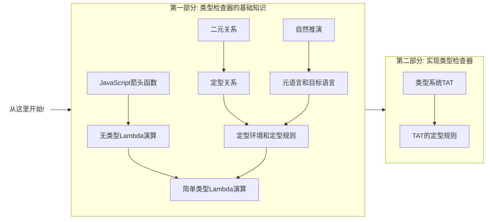

# 类型系统入门

吴登轲 高洁璇

---
layout: section
---

# 第一节：类型系统简介

---
layout: statement
---

## 直觉中的类型

---
layout: statement
---

## 命题 1：自然数 997 是一个质数。

---
layout: statement
---

## 命题 2：自然数 997 是一个跑。

---

# 自然语言中的类型

在知道类型系统的定义之前，我们其实都已经是汉语这门自然语言中的「类型」专家了。

<!-- 汉语是一种自然语言。

- 汉语的词性包括：动词，名词，形容词，副词……它们其实就是「词语」组成的集合，它们是词语的类型。

- 第一句话是一个正确的命题。我们稍微修改一下这句话，得到第二句话。本应该是名词待的位置，却被替换成了动词，让这个句子失去了合法性。 -->

<br>

> 例 1：997 是一个质数。

> \*例 2：997 是一个跑。

<br>

-   如果我们来判断这句话第二句话是否正确，我们可以立刻下结论——它是错的——而不用去理解这个命题涉及的任何数学概念。因为这句话在**语法**上就是错的。这其实就是一种类型检查。

<!-- TODO: 从和编程语言的对应上来说，semantic-selection 其实才是类型检查……需要修改例子和文案 -->

<br>

那么，在编程语言这个形式系统里，我们是不是也可以有类似的快速「检查」？

——这样，我们可以用很低的成本来验证程序是否是对的，而不需要去跑程序本身。

---

# 编程语言中的类型

##

在一些编程语言中，变量的类型可以在运行程序之前就能确定下来。具有这种性质的语言，叫做静态类型语言；反之，则叫做动态类型语言。

```cpp
// CPP 是一门静态类型语言
int a = 10;
a = 'b'; // 会在编译时报错
```

```js
// JavaScript 是一门动态类型语言
let a = 10;
a = 'b'; // 完全合法
```

而有一些编程语言当中，表达式类型之间的转化需要显式地进行，锱铢必较。

这种语言，叫做强类型语言(Strongly-typed Languages)；

反之，那些类型之间的转化大都可以隐式进行的，叫做弱类型语言(Weakly-typed languages)。

> 注意：强弱类型其实是一个比较主观的概念，并没有非常严格的定义。

---

layout: statement
---

## 什么是类型系统？

---

# 类型系统的基本概念

-   一个**值 (Value)**，就是某个东西。它既可以是一个直观上的概念，也可以被解读为编程语言中的**项**。

-   一个**搜集 (Collection)**，就是一堆东西组成的整体。它是一个直观上的概念。

<!-- TODO: 注释一下为啥不用一个更严格的词 -->

-   一个**类型 (Type)**，就是一个由**值**组成的**搜集** [^ts] （你可以直观地认为类型就是一个值组成的**集合**)。

    -   在编程语言中，**一个表达式的类型**就是它在执行之时估计会取到的值形成的一个 **搜集** [^ts]。

## 什么是类型系统？

在编程语言中，**类型系统 (Type System)** 就是一个**类型规则的搜集**，这种规则能为项确定类型。

这些规则都是如果 A，则 B 的形式。例如：如果`a: number, b: number`，那么`(a+b): number`。

<!-- # 类型系统背后的理论：类型论 -->
<!-- 编程语言是一种形式系统。而 **类型论 (Type Theory)** 作为编程语言的类型系统后的理论基础，则有更广的对象：它是关于所有形式系统中的项的类型的学术化的研究 [wiki]。 -->

<!-- ## 类型论的历史 -->

<!-- 类型论 (Type Theory) 从 20 世纪初期发端。…… -->

<!-- ## 什么是类型系统？

"A type system is a tractable syntactic method for proving the absence of certain program behaviors by classifying phrases according to the kinds of values they compute." - [^tapl] -->

[^ts]: [Type Systems](http://lucacardelli.name/papers/typesystems.pdf)

---
layout: statement
---

## 为什么要用类型系统？

---

# 为什么要使用类型系统？

##

-   在计算机科学和软件工程中，我们可以用形式化方法(formal methods)来检查一个软件或是硬件系统是否满足某种性质。例如：

    1. 将芯片设计抽象为模型(model)，使用模型检查器(model checker)证明它的行为符合规范[^tapl];

    2. 使用$\pi$-演算来描述一个并发系统的行为[^2]，证明它不会出现死锁；

    3. 使用证明助手 Coq，来构建形式化的证明，从数学上证明星载实时操作系统 SpaceOS 的内核设计符合一些性质[^1]。

-   类型系统，以及类型检查，可以看成是一种轻量的形式化方法 (formal method)，它也是一种验证软件**性质**的手段[^tapl]。 我们想要的**性质**，一般就是程序不会出某些运行时错误。

[^tapl]: [Benjamin C. Pierce. 2002. Types and Programming Languages (1st. ed.). The MIT Press.](https://dl.acm.org/doi/book/10.5555/509043)
[^1]: 顾海博, 付明, 乔磊,等. SpaceOS 中若干全局性质的形式化描述和验证[J]. 小型微型计算机系统, 2019, 40(1):8.
[^2]: 焦文品, 史忠植. 形式化多主体系统中的交互及交互协议[J]. 软件学报, 2001.

<style>
.footnotes-sep {
  @apply mt-0 opacity-10;
}
.footnotes {
  @apply text-sm opacity-75;
}
.footnote-backref {
  display: none;
}
</style>

---
layout: statement
---

## 类型系统有哪些好处？

---

# 类型系统能帮我们发现错误

<br>

<div grid="~ cols-2 gap-2">

```ts {monaco}
type Status = 'finished' | 'unfinished';

const StatusDisplayDict: Record<Status, string> = {
    finished: '已完成',
    unfinished: '未完成',
};
```

```ts {monaco}
type Status = 'finished' | 'unfinished' | 'processing';

const StatusDisplayDict: Record<Status, string> = {
    finished: '已完成',
    unfinished: '未完成',
};
```

</div>

---

# 类型系统能帮我们发现错误（续）

```ts {monaco}
type MyEvent = { kind: 'resize'; hw: [number, number] } | { kind: 'select'; keys?: string[] };
// @ts-expect-error
function badHandleEvent(e) {
    // 这里不小心少考虑了几种情况……
    const keysHash = [...e.keys].sort().join('#');
    console.log(`keys' hash is: ${keysHash}`);
}
function goodHandleEvent(e: MyEvent) {
    if (e.kind === 'resize') {
        const [h, w] = e.hw;
        console.log(`area: ${h * w}`);
    } else if (e.kind === 'select') {
        if (e.keys) {
            const keysHash = [...e.keys].sort().join('#');
            console.log(`keys' hash is: ${keysHash}`);
        } else {
            console.error('selected, but nothing selected!');
        }
    }
}
```

<style>
iframe{
  height: 380px !important;
}
</style>

---

# 类型系统能提供抽象机制

类型系统不止可以用于发现错误。

## 建立模块抽象

-   不同的模块之间产生交互时，只需用约定接口类型，即可各自开发。

-   可以快速地通过模块导出的类型了解模块的功能。

## 建立领域模型

可参考前一页的代码。「**类型、领域、代码同构**」。类型其实也是一种对领域进行建模、对业务进行建模的手段。

---

# 类型系统能提供文档能力

类型就是比自然语言更加精确的文档。

不必写注释明说如何使用`add`函数。用心去感受……

```ts {monaco}
function add<A extends string, B extends string>(first: A, second: B): `${A}${B}`;
function add(first: number, second: number): number;
function add(first: unknown, second: unknown): unknown {
    return ((first as any) + second) as any;
}

add('1', 2); // 类型错误
add('1', 2 as string); // 类型错误
add('1', '2'); // 正确
add(1, 2); // 正确
```

<style>
iframe {
  height: 380px !important;
}
</style>

---

# 类型系统能提供文档能力（续）

类型就是比自然语言更加精确的文档。

可以用类型系统做流程控制。例如，限制代码必须无 lint 错误才能提交。

```ts {monaco}
type Code = { fileList: string[]; addedTime: Date };
declare const LintInternalSymbol: unique symbol;
type Linted<T> = T & { [LintInternalSymbol]: undefined };
declare function lint<T extends Code>(code: T): Linted<Code>;
declare function commit(code: Linted<Code>): Promise<void>;

declare const code: Code;

commit(code);

commit(lint(code));
```

<br>

在 TypeScript 的结构化定型的类型系统中，往对象上添加元信息来模拟 **名义类型** (Nominal Type)的这种技巧俗称"打标"(Tagging)。

<style>
iframe{
  height: 280px !important;
}
</style>

---
layout: statement
---

## 为什么要学习类型系统？

---

# 为什么要学习类型系统？

-   入门类型论，提高理论水平，为之后在类型系统以及编程语言上的探索打下基础；

-   俯瞰各个语言的类型系统；

-   对 TypeScript 的类型系统产生更深的理解，在日常工作中，写出质量更高的程序；

-   写一个自己的类型检查器，并且能够添加自己想要的特性；

-   ...

---

# 课程介绍

-   本课程主要面向有一定经验的 TypeScript 用户，对于没有 TypeScript 经验的学习者，可以在先学完 TypeScript 课程再来学习本课程。

-   本课程不预设学习者有特别的数学背景，尽量简化用到的数学知识，并会对学习者可能不熟悉的数学知识进行及时的介绍。但是，学习者应当熟悉高中数学涉及到的命题逻辑(比如，$\land$, $\lor$, $\lnot$, $\forall$)以及简单的集合论等相关知识。

-   本课程的一大特色就是**产出导向**。每一节课之后，都设有需要动手编码的小作业。如果你完成了每节课后的作业，那么你最终就能得到一个属于自己的，理论能力和 TypeScript 一样强大的类型检查器，且有一个**图灵完备**的类型系统。这意味着你可以在编译期而非运行时实现一个图灵机。

---

# 课程路线图

### 第二节：类型检查器基础

-   $\lambda$-演算；类型；类型的集合模型；函数类型；元语言和目标语言；定型；定型环境；二元关系；定型关系；定型规则；自然演绎；类型系统的完备性以及可靠性。
-   在这一节的作业要求你实现一个有着最基础类型的类型检查器。

### 第三节：子类型理论以及实现

-   子类型关系；里氏替换原则；子类型的集合模型；函数的逆变、协变、不变。
-   这一节你将往类型检查器中加入子类型这个特性。

### 第四节：多态理论以及实现

-   泛型；子类型多态；特设多态；参数多态；let 多态；顶类型和底类型；全称量词和全称类型；extends 关键字；类型参数。
-   这一节你将往类型检查器中加入泛型。

---

# 课程路线图（续）

### 第五节：递归类型理论以及实现

-   $\mu$-构造器；链表、树的递归类型定义；有类型的 Y 组合子。
-   在这一节，你将往类型检查器中加入对递归类型的支持。

### 第六节：总结和展望

-   类型检查器成品回顾；TypeScript 的类型体操以及例子；柯里霍华德同构。
-   在这一节，你将使用你自己写的类型检查器解决一系列有挑战性的问题，并了解这个玩具类型检查器还有什么特性可以添加。

---
layout: statement
---

## 我们在哪里？

---

# 类型论的大图景

##

类型论(Type Theory, TT)是类型系统背后的理论。

在理论计算机科学(Theoretical Computer Science, TCS)的编程语言理论(Programming Language Theory, PLT)中，它是一个重要话题。

TCS 中的 TT 主要有两个分支：

1. TT 在编程语言中的应用。这表现为编程语言的类型系统。TypeScript 就是一个类型系统的非常好的应用；
2. 纯类型系统(Pure Type System, PTS)。这个分支比较偏向理论，并不关注它在工业界的应用。但是编程语言的设计也时常能够从中汲取一些营养。

<!-- # 纯类型系统

##

PTS主要研究有类型$\lambda$-演算。在简单类型$\lambda$-演算(Simply Typed Lambda Calculus, STLC)的基础上，组合三种正交的特性，我们可以得到8种不同的$\lambda$-演算的变体，从而画出如下类似立方体的图案。它叫做$\lambda$-cube。


这三种能力分别是：多态($\uparrow$)，类型操作符($\nearrow$)， 依值类型($\rightarrow$)。我们在这个课程中，将要构建出有其中两种特性（和TypeScript相同）的类型检查器，对应图中的$\lambda\omega$。 -->

<!-- lambda cube -->
<!-- https://twitter.com/cattheory/status/984976270772654080 -->

---

## 参考文献

[Type Systems](http://lucacardelli.name/papers/typesystems.pdf)

[Benjamin C. Pierce. 2002. Types and Programming Languages (1st. ed.). The MIT Press.](https://dl.acm.org/doi/book/10.5555/509043)

---

## 延伸阅读

[Lambda cube and dependent types](https://www.math.nagoya-u.ac.jp/~garrigue/lecture/2018_tenbo/dependent.pdf)

---
layout: section
---

# 第二节：类型系统的基础

---

# 本节路线图

<div class="mt-3.5rem -ml-2rem">



</div>

---


# 目标类型系统：TAT

## 名字的由来

在这个课程中，我们会实现一个自己的类型检查器，我把它叫做**TAT**(发音:/tæt/)。没有什么特别的原因，只是因为它像一个哭脸的颜文字 😭，而且是个回文串，非常有意思。

## 它的特性

- 它的基本类型命名会尽量避免和JavaScript已经有的类型名字冲突。比如，我们会用`Num`来表示TAT中的数字类型，而不是`number`。`number`会用来特指JavaScript或者TypeScript中的数字类型。


---

# 程序错误的分类

##

习惯上，我们会将程序的错误作如下分类：

### **语法错误**

程序不符合这门语言的语法规则。比如，此程序无法由目标语言的语法规则生成得到。例如：`let 0 = 2;`

### **语义错误**

程序的语法错误之外的错误。比如此程序在执行时计算结果不符合预期，或者可能存在死循环等等。

### **编译期错误**

程序在编译时，编译器报错。

### **运行时错误**

程序在执行的时候，产生错误。

---
layout: statement
---

## "程序错误"的不严格的定义：

## 如果程序不满足某些给定的**性质**，程序就是可以说是错误的。

---

# 程序错误的分类（续）

##

**性质**可以是**任意**的。我们定义了如下几种性质：

<div v-click>

-   $P_0 \triangleq \text{在被执行之后，会在1s内给出问题的解；并能通过所有测试用例}$；
-   $P_1 \triangleq \text{能够在解释执行时以ES 6标准parse}$；
-   $P_2 \triangleq \text{不会在执行时抛出未经捕获的异常}$。
-   $P_3 \triangleq \text{作为编译输入时，不会让\texttt{TypeScript}编译器报类型错误}$；
-   $P_4 \triangleq \text{能够通过 ``无冗余变量" 和 ``操作符两边无空格" 的Lint}$；

问题：如果不满足这些性质，那么程序的错误对应**语法错误**、**语义错误**、**编译期错误**、**运行时错误**中的哪些呢？

</div>

<div v-click>

-   语法错误: $P_1, (可能有P_2),  P_4$；
</div>
<div v-click>

-   语义错误: $P_0, P_2, P_3, P_4$；
</div>
<div v-click>

-   编译期错误: $P_3, P_4$；
</div>
<div v-click>

-   运行时错误: $P_0, P_1, P_2$。
</div>

---

# 类型错误

##

我们看到了语法、语义，编译期、运行时这四种错误，并且发现它们可以分为两组(语法、语义，编译期、运行时)，而组间是正交的。
并且，这种错误的定义其实非常宽泛，只要从更高的角度去看待错误或者更换一下背景条件，总能很容易地把程序错误归类成任意一种你想要的错误：

-   变量名不符合规则是个语法错误；
-   变量名不符合规则，导致调用此程序的其他程序出现了异常，就成了语义错误。

-   编译执行 C 语言的时候，函数签名和实际参数类型不匹配，是编译期错误；
-   解释执行 C 语言的时候，函数签名和实际参数类型不匹配，是运行时错误。

---

<!-- # 错误的本质是什么

##

在求值一个JavaScript的表达式的时候，解释器其实是在机械性地根据表达式的种类，应用不同的求值规则。

```js
null.toString();
``` -->

<!-- 机械性地应用规则 -->
<!-- 解释器通过语法结构，分析出这应该应用什么规则 -->
<!-- 规则的应用有一些前提条件，不满足这些前提条件，解释器就不知道要怎么计算下去了 -->
<!-- 不知道怎么计算下去，也就是stuck。这就是求值错误的本质之一。-->

<!-- 因此，只好中断求值。抛出异常。-->
<!-- 在表达式求值阶段发生的错误，都是运行时错误。也都是语义错误。 -->
<!-- 结论：异常的本质就是一些前提条件不满足，解释器不知道要怎么计算下去了 -->

<!-- 比如，上面的代码就将`test`"作为一个函数"进行调用，解释器使用的是函数调用的求值规则。

这里，其实有一个非常重要的假设，那就是：`test`真的是一个函数。

> 思考题：如果`test`不是一个函数，这个表达式的求值又应该应用什么规则呢？

最佳答案是：不知道，至少解释器不知道。因为这个求值规则，没有写到语言的标准里，JavaScript不知道`null()`应该如何求值。

"作为一个函数"，到底意味着什么？其实，解释器在求值这个表达式调用的时候，其实预设了`test`有一些。
这是说程序的编译、执行过程中的每一步，都符合预先定义好的规则。

我们刚刚看了一些$\lambda$-演算以及JavaScript的例子。
但是，要是写下的JavaScript表达式不那么对劲，我们会得到什么？比如： -->

# 错误的本质是什么

```js
x =>   // 故意不写返回值
x =====> x // 箭头很长
(1)()  // 故意把数字当成函数进行调用
```

JavaScript 解释器在这些不按套路出牌的表达式的时候，肯定会陷入迷茫 (Stuck)……此时就出现了错误。

<!-- 这些例子都是没有**错误**、能**正常**跑起来的。
但是，什么是错误？又如何定义正常？ -->

<!-- 其实，JavaScript对表达式的求值遵循它的一套规则。JavaScript解释器对表达式求值的过程中，无法匹配到任何一条规则的时候，就会陷入迷茫…… -->


---

# 错误的本质是什么（续）

##

解释器为什么会陷入迷茫？迷茫的本质在于，此时解释器无法按照对待正常的 JavaScript 表达式那样继续处理下去了。


---


# 二元关系

<!-- 在刻画集合内的元素之间的关联的时候，**关系**(Relation)是一个有力的工具。 -->

##

定义：若集合$R$满足$R\subseteq S\times S$，那么$R$就是一种集合$S$上的二元关系(Binary Relation)。

二元关系的例子：自然数集$\N$上的**小于**关系$R$，即我们通常所知的"$<$"。

$$
\begin{align}
R & := \{(0, 1), (0, 2), \dots, (1, 2), \dots \}, 或等价地 \\
R & := \{ (n, n+m) : n\in \N, m\in \N^+ \}
\end{align}
$$

关于记号的一些说明：

<div v-click>

- $:=$ 符号是一种特殊的等号，它表示将这个等式的左边的表达式定义为右边的表达式。
 </div>
 <div v-click>

- $\{ n : n\in \N \}$是 $\{n\mid n\in \N\}$的另外一种写法，也是一种可接受的集合记号。它用$:$代替了$\mid$，书写更加方便，我们会全部使用前者。
 </div>

---

# 二元关系（续）

##

<iframe class="w-full" src="https://q.uiver.app/?q=WzAsNSxbMSwwLCIxIl0sWzIsMCwiMiJdLFszLDAsIjMiXSxbMCwwLCIwIl0sWzQsMCwiXFxjZG90cyJdLFswLDFdLFszLDBdLFsxLDJdLFszLDEsIiIsMCx7ImN1cnZlIjotMn1dLFswLDIsIiIsMSx7ImN1cnZlIjotMn1dLFszLDIsIiIsMSx7ImN1cnZlIjotNX1dLFsyLDRdLFsxLDQsIiIsMSx7ImN1cnZlIjoyfV0sWzMsNCwiIiwxLHsib2Zmc2V0IjoyLCJjdXJ2ZSI6NX1dLFswLDQsIiIsMSx7ImN1cnZlIjo0fV1d&embed" width="788" height="286" style="border-radius: 8px; border: none;transform:scale(0.8);"></iframe>

自然数集上的小于关系，$R := \{ (n, n+m) : n\in \N, m\in \N^+ \}$
可以省略地画成这样。

1. 可以看到，有小于关系的两个数$x, y$都有一根有向箭头连接。
2. 我们会说$(0, 1)\in R$或者使用**中缀**的写法，写成$0R1$。

---

# $n$元关系

##

二元关系其实只是$n$元关系($n\in \N$)的特例。而关系也可以定义在**自然数个集合**之上。

-   二元关系。整除关系。

    $$
    \text{Divides} := \{ (n, m) : n\in \N^+, m\in \N, m\bmod n = 0 \}，其中 \\
    $$

    $x\bmod y = k$ 表示 $x$ 被 $y$ 除余 $k$。

-   一元关系。是否是偶数。

    $$
    \begin{align}
    \text{IsEven}:=\{0,2,4,6 \dots\}=\{n: n\in \N, 2\ \text{Divides}\ n\} \subset \N
    \end{align}
    $$

    一元关系也叫做一元**谓词**(Predicate)。谓词也可以看成是接受若干个元素，返回`true`或者`false`的函数。

---

# $n$元关系（续）

<!-- - 三元关系。
$$
\begin{align}
\text{SumEquals} & := \{(0,0,0), (0,1,1), (0, 2, 2), \dots, (1, 0, 1), \dots \} \\
                 & = \{(n, m, k) : n\in \N, m\in \N, k\in \N, n+m=k\}
\end{align}
$$ -->

-   三元关系。
    $$
    \text{ASCII} = \{(\texttt{A}, 65, \text{0x41}), (\texttt{B}, 66, \text{0x42}),\dots \} \subset \text{Letter}\times \Z \times \text{HexNumber}
    $$

在本课程中，我们会主要使用二元关系和三元关系。它们是我们刻画**项**、**类型**、**定型环境**之间关系的有力工具。

注意：关系的数学本质仅仅是一个集合。定义哪些元素之间存在关系的时候完全是任意的。不必像我们刚刚看的那些例子一样，非得将每个关系都解释出现实意义不可。

<div v-click class="my-10 text-center">
练习：请举出一个四元关系的例子。
</div>

---

# 定型关系

##

如同我们在 TypeScript 中做的那样，在类型系统的文献中，我们会将一个项$t$以及这个项的类型$T$的关系，记做一个中缀表达式

$$
t:T
$$

其中，"$:$"是一个将项和类型连接的符号。

因为这个关系涉及项和类型两个元素，因此它是一个二元关系。这个关系就是**定型关系**(Typing Relation)。

我们通常会把定型关系解读为「项$t$是一个类型$T$」。比如$\text{🍎}: 水果$就可以解读为，🍎是一个水果，或者是🍎是一个水果类型的实例。

「水果」可以看成是一个集合，其中包含了一切水果，因此我们也可以说

$$\text{🍎} \in \text{水果}$$

---

# 用自然推演来书写定型规则

##

接下来，我们开始逐渐往TAT中添加类型，丰富这个类型系统。 我们首先加入`Number`一种类型。

对于二元的加法`+`来说，我们有：

$$
{x: \mathbf{Number},\ y: \mathbf{Number} \over x + y : \mathbf{Number} }\ (\text{N-Add})
$$

- 每个推演规则，都由横线上下分割。

- 在横线之上的，是使用这条规则的前提；横线之下的，是在前提满足的情况下，使用这条规则能得到的结论。 

- 横线右边的，是出于便于讨论的目的，给这条规则取的名字。这条规则叫做`N-Add`。


`N-Add`这个规则的意思是说：若`x`的类型是`Number`，`y`的类型是`Number`，那么`x+y`也是`Number`。

这种写法，叫做**自然推演**(Natural Deduction)。

---

# 使用自然推演来构造导出树

##

### 问题

若已知 `x: Number`, `z: Number`，`y: Number`, 那么`x+z+y`是什么类型呢？

### 思路

1. 我们的`+`如同JavaScript中的`+`一样是左结合的，也就是说$x+z+y$等价于$(x+z)+y$。
2. 那么，我们只需要知道$x+z$是什么类型，就可以知道$x+z+y$是什么类型……

### 解法

$$
\frac{
  \frac{ \displaystyle x:\ \mathbf{Number}, z:\ \mathbf{Number}}{ \displaystyle x+z:\ \mathbf{Number} } \qquad {y:\ \mathbf{Number}}
} {
  (x+z)+y:\ \mathbf{Number}
}
$$

可以看到，我们将`x+z+y: Number`的推演过程组织成了一棵树，它叫做导出树(Derivation Tree)。同时，因为这棵树也构成了一个对`x+z+y: Number`的证明，因此它也叫做证明树(Proof Tree)。

---

# 类型系统中缺少的一环

##

### 问题

N-Add 规则告诉我们，如果我们知道`+`的两个操作数的类型都为`Num`，那么我们就知道这个表达式的结果也为`Num`。
但是，这个规则并没有告诉我们，TAT 中什么样的项，才是`Num`类型的实例。

$$
{x: \mathbf{Num},\ y: \mathbf{Num} \over x + y : \mathbf{Num} }\ (\text{N-Add})
$$


形式化地来说，下面这个式子的`???`部分，需要填上些什么呢？

$$
{??? \over x: \mathbf{Num}}
$$

<!-- 我们都知道，`1`和`2.0`乃至`-1e15`都是 JavaScript 中的`number`类型的实例。我们希望 TAT 中的`Num`类型和 JavaScript`number`类型相同，那么`1`和`2.0`乃至`-1e15`也都是`Num`类型的实例。 -->

### 思路

我们尚未有任何根据来判断在TAT中一个项是不是`Num`类型！ 在TAT中，我们可以说对JavaScript的语法一无所知，而一个项是否是`number`的实例，却正与JavaScript语法紧密相关。或许我们应该去求助JavaScript的语法？

---

# 利用类型系统之外的结构来定义原始类型

##

### 解法

而在JavaScript当中，通过语法分析得到的AST节点恰好有NumberLiteral (具体名字待定，数字字面量)这种语法类别(Syntax Kind)，完全符合JavaScript对`number`类型实例的定义。
因此，我们可以将具有NumberLiteral这种类型的节点对应的项，`Num`类型的实例。

### 类比

同样地，我们可以利用AST上的节点的语法类别，继续扩张TAT的基本类型，定义布尔值字面量为`Bool`类型、字符串字面量为`Str`类型……

问题来了，TAT的函数类型，就叫做`Fun`好了，它怎么定义呢？在回答这个问题之前，我们先参考一下JavaScript和TypeScript是怎么处理最最基本的函数类型的。

---

# JavaScript 口味的无类型$\lambda$-演算

##

JavaScript的箭头函数，和$\lambda$-演算(Lambda Calculus)关系密切。 它是一种非常重要的计算模型。

它有两种基本操作：抽象(Abstraction)、应用(Application)。另外一个重要的概念就是变量(Variable)。

在这门课程中，我们不会对$\lambda$-演算下一个形式定义，你只需要将它类比成 JavaScript 中的箭头函数即可。这样大多数关于箭头函数的直觉都可以沿用下来。
**无类型**一词，指的是我们现在考虑的$\lambda$-演算还没有包含任何类型。

下面是一些$\lambda$-演算和 JavaScript 中的对应物的例子。

<div grid="~ cols-2 gap-2">

```php
λx.x+1
λx.λy.x+y
(λx.λy.x+y 1) // 得到 λy.y+1
((λx.λy.x+y 1) 2) // 得到 3
λx.λy.x+y 1 2 // 括号可以省略，同样得到3
```

```js
x => x + 1;
x => y => x + y;
(x => y => x + y)(1); // 等价于 y=>y+1
(x => y => x + y)(1)(2); // 3
```

</div>

定义函数，$\lambda$-演算中叫做抽象；调用函数，叫做应用；函数的形式参数叫做变量。

---

# TypeScript 口味的简单类型$\lambda$-演算

---

 <!-- 函数类型；元语言和目标语言；定型环境；类型系统的完备性以及可靠性。 -->

<!-- ## 定型关系(Typing Relation)
定义：在定型环境$\Gamma$，下 -->


<!-- ---

# TypeScript 的类型系统

## TypeScript 中的类型概览

在 TypeScript 4.5 中，我们有`number`, `boolean`, `string`, `bigint`, `symbol`，以及`undefined`, `null`[^1]这 7 个**原始类型(Primitive Type)**，还有`Array`, `Object`, `Function`等等**引用类型**。

[^1]: `null`和`undefined`可以解释为字面量类型，但是这里还是按照 JavaScript 的提法，将其同样认为是原始类型。 -->

---

# 扩展阅读

##

[让我们来谈谈$\lambda$演算](https://github.com/txyyss/Lambda-Calculus/releases/download/v1.0/lambda.pdf)
